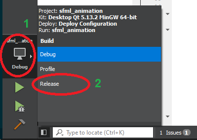
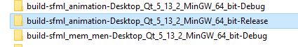
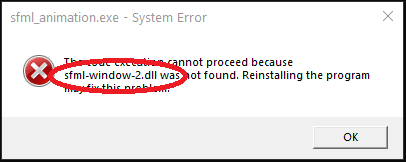

# Deploy of .exe application

## What is Deploy

To this point we have run all of our programs in environment prepared by an Integrated Developer Environment (eg. *Qt Creator* or *Visual Studio*). Usually, when the program/application is ready it is needed to prepare the program in such a way that it would be possible for the end-user to run it. For Windows system usually it is necessary to prepare an `.exe` file together with accompanying `.dll` files and files loaded by our program, for example textures or data-base files.

## Example of deploying a program for Windows

The example below assumes usage of the *Qt Creator*, however the procedure for a different IDE will not be very different, as most commonly only the source paths will change. For this tutorial, we assume that the we are deploying a project called ***sfml_animation***.

### 1. Compilation of the *Release* version

Up to this point, during the work on all our programs, we have executed the compilation procedure in *Debug* mode. *Debug* mode, as it names states, allows us to run the application in the debug, which causes the final binary/execution file to contain additional information not needed by the end-user. The correct version to deploy the program should always be the *Release* version.

In order to switch to the *Release* mode in *Qt Creator* click the build configuration icon (1), and then choose **Release** (2):



Next build your project (*Ctrl + B*) and wait for the compilation process to finish. For further development of the program it is always recommended to switch back to the *Debug* mode.

### 2. Destination folder preparation

Create a destination folder anywhere on the disk to which you will copy all the files necessary to run the program. The folder name does not matter, you can choose anything.

### 3. Copying the .exe file

*Qt Creator* automatically build the project in automatically created for this purpose folder, so called *build folder*. This is the same folder in which we have placed the texture files, but in this case it will be marked with *Release* at the end of its name (**WARNING**: If the project was previously compiled in *Debug* mode you will find two folders with very similar names, choose the one with *Release* at the end).

Open the *Release* build folder:



After opening, open the *release* folder and copy the `.exe` file into the destination folder.

### 4. Copying compilers .dll files

Our execution `.exe` file does not include all the necessary information needed to run the program, great part of the functionality is included in the `.dll` files provided with the compiler. These precompiled libraries are needed to run the program.

#### If you are using *MinGW* compiler

*MinGW* is a compiler used during this course by default. If you have not changed *Qt Creators* default installation folder you will find the files needed in the following folder (*WARNING*: if you are using different compiler version choose a folder marked with a proper compiler version):

```plaintext
C:\Qt\Tools\mingw730_64\bin
```

From the above folder copy the following files into the destination folder:

- `libgcc_s_seh-1.dll`,
- `libstdc++-6.dll`,
- `libwinpthread-1.dll`.

#### If you are using *MSVC* compiler

...

### 5. Copying libraries' .dll files

If you are using any external libraries (like *SFML*) you will have to copy to the destination folder all the necessary library-related `.dll` files. A set of `.dll` files will significantly differ from library to library. If you are not sure which files you should copy, on this point of the process, you can already try running the program in the destination folder, error window will pop up showing which files are missing. Fill in the missing files until the errors stop appearing:



For *SFML* library put the following files in the destination folder:

- `sfml-audio-2.dll`,
- `sfml-graphics-2.dll`,
- `sfml-network-2.dll`,
- `sfml-system-2.dll`,
- `sfml-window-2.dll`.

Note that the file names do not contain `-d-` in the name, which describes the `.dll` file relevant to the *Debug* mode.

### 6. Copying additional files - assets

If your program uses any additional files (eg. textures, audio files, data-bases, text files), you should place them in the destination folder, just like you did for the *build folder* during the program creation and while running it in the IDE. Remember to mantain the folder structure and hierarchy,

If the application has used absolute paths to external files, correct them for relative paths and re-prepare deploy.

### 7. Running the program

So prepared deploy, after double-clicking `.exe` should properly run our program on any computer running 64 bit Windows.

---
Authors: *Tomasz Mańkowski*
