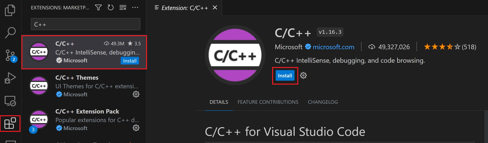
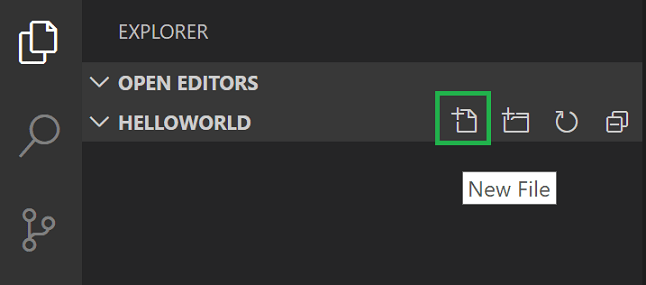
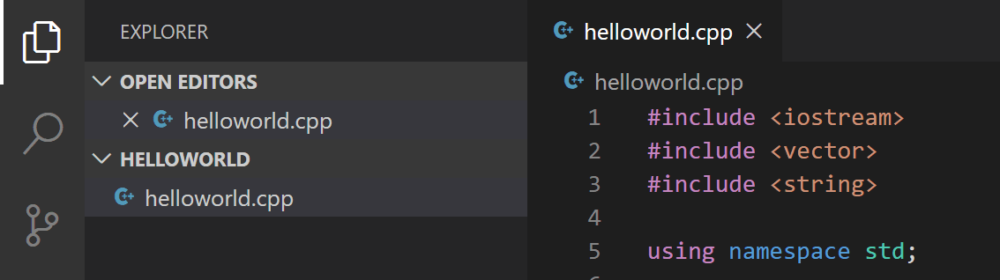
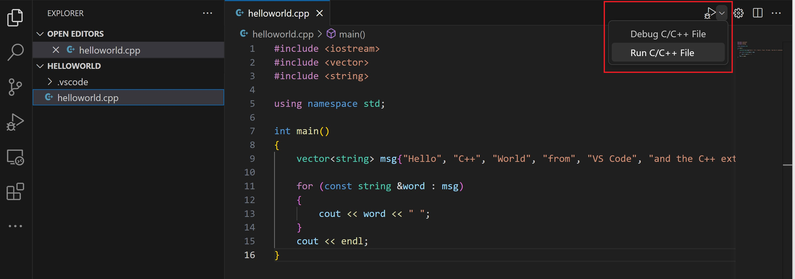
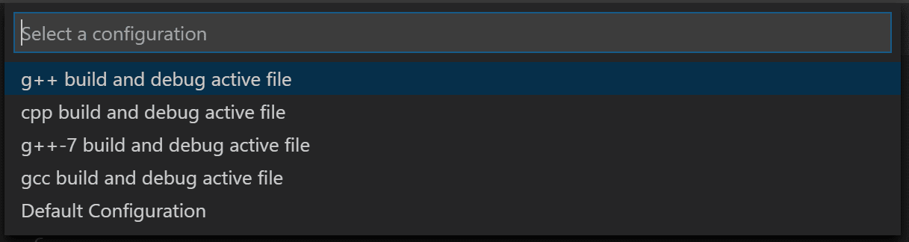
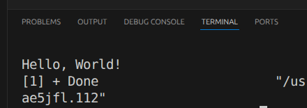
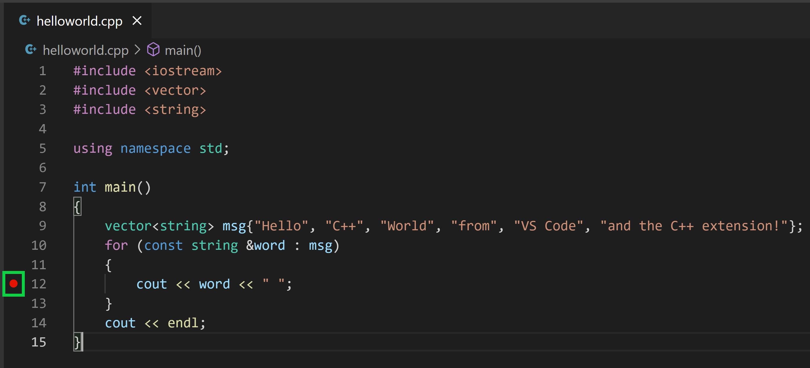
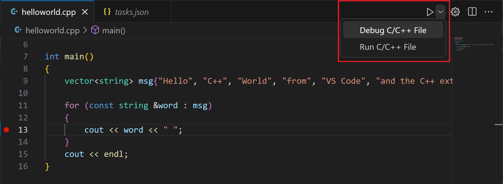

# VS Code setup for Ubuntu

## First time setup

### Install prerequisites

If you are working on the PC in the lab, you can skip this step.

```bash
sudo apt update
sudo apt install -y build-essential gdb cmake pkg-config
```

### Install VS Code

If you are working on the PC in the lab, you can skip this step. Otherwise, you can install VS Code by following the instructions on the [official website](https://code.visualstudio.com/docs/setup/linux). 

Launch VS Code and install following extensions. You can do this by clicking on the Extensions icon on the left sidebar (`Ctrl+Shift+X`) and searching for the extension name or ID:
- C/C++ (by Microsoft) - `ms-vscode.cpptools`



## Create a new C++ project

You can create a new C++ project by following these steps:

1. Open VS Code and create a new folder for your project.
2. Open the folder in VS Code (`File > Open Folder`).
3. Create a new file named `main.cpp` and add the following code:



```cpp
#include <iostream>

int main() {
    std::cout << "Hello, World!" << std::endl;
    return 0;
}
```

4. Save the file (`Ctrl+S`). Notice that your files are listed in the File Explorer view (`Ctrl+Shift+E`) in the side bar of VS Code:



## Build and run the project

1. Open `main.cpp` in the editor so that it is the active file.
2. Press the play button in the top right corner of the editor (`Run and Debug`), or press `F5` to start debugging. If this is your first time running the project, you will be prompted to select a debug configuration. Choose `C++ (GDB/LLDB)`.





3. After the build is complete, you should see the output "Hello, World!" in the integrated *Terminal* at the bottom of the VS Code window. Make sure to check the *Terminal* tab if you don't see the output immediately.



## tasks.json

The first time you run your program, the C++ extension creates tasks.json, which you'll find in your project's .vscode folder. tasks.json stores build configurations. You can customize it to add more build options or to change the build command. For example, you can add a new task to build your project with different flags or to run a different executable. Your tasks.json file might look like this:

```json
{
    "tasks": [
        {
            "type": "cppbuild",
            "label": "C/C++: g++ build active file",
            "command": "/usr/bin/g++",
            "args": [
                "-fdiagnostics-color=always",
                "-g",
                "${file}",
                "-o",
                "${fileDirname}/${fileBasenameNoExtension}"
            ],
            "options": {
                "cwd": "${fileDirname}"
            },
            "problemMatcher": [
                "$gcc"
            ],
            "group": {
                "kind": "build",
                "isDefault": true
            },
            "detail": "Task generated by Debugger."
        }
    ],
    "version": "2.0.0"
}
```

## Debugging

### To debug your code:

1. Go back to helloworld.cpp so that it is the active file.
2. Set a breakpoint by clicking on the editor margin or using F9 on the current line.



3. From the drop-down next to the play button, select Debug C/C++ File.



The play button has two modes: Run C/C++ File and Debug C/C++ File. It will default to the last-used mode. If you see the debug icon in the play button, you can just select the play button to debug, instead of selecting the drop-down menu item.

### Exploring the Debugger

More info on how to use the debugger can be found in the [official documentation](https://code.visualstudio.com/docs/cpp/config-linux#_explore-the-debugger). 

## Adding more cpp and h files

When you work with larger projects, you will likely want to split your code into multiple files. You can create new .cpp and .h files in the same way you created main.cpp. For example, you can create a new file named `utils.cpp` and add the following code:

```cpp
#include "utils.h"
#include <iostream>

void printMessage(const std::string& message) {
    std::cout << message << std::endl;
}
```

Then, you can create a header file named `utils.h` and add the following code:

```cpp
#ifndef UTILS_H
#define UTILS_H
#include <string>
void printMessage(const std::string& message);
#endif // UTILS_H
```

To use the functions defined in `utils.cpp`, you need to include `utils.h` in your `main.cpp` and call the function. For example:

```cpp
#include <iostream>
#include "utils.h"

int main() {
    printMessage("Hello, World!");
    return 0;
}
```

When you build your project, make sure to include all the .cpp files in the build command. You can modify your tasks.json to include all the .cpp files in the current directory:

```json
{
    "tasks": [
        {
            "type": "cppbuild",
            "label": "C/C++: g++ build active file",
            "command": "/usr/bin/g++",
            "args": [
                "-fdiagnostics-color=always",
                "-g",
                "${workspaceFolder}/*.cpp",
                "-o",
                "${workspaceFolder}/app"
            ],
            "options": {
                "cwd": "${workspaceFolder}"
            },
            "problemMatcher": [
                "$gcc"
            ],
            "group": {
                "kind": "build",
                "isDefault": true
            },
            "detail": "Task generated by Debugger."
        }
    ],
    "version": "2.0.0"
}
```

The main change here is that we replaced `${file}` with `${workspaceFolder}/*.cpp` to include all .cpp files in the current directory. We also changed the output executable name to `app` for clarity.

## Including SFML

Later in the course, we will be using the SFML library for graphics programming. You don't have to follow this until being instructed to do so by your instructor. 
To include SFML in your project, you need to install it first. You can do this by running the following command in your terminal:

```bash
sudo apt install libsfml-dev
```

After installing SFML, you can include it in your project by adding the following lines to your tasks.json:

```json
{
    "tasks": [
        {
            "type": "cppbuild",
            "label": "C/C++: g++ build active file",
            "command": "/usr/bin/g++",
            "args": [
                "-fdiagnostics-color=always",
                "-g",
                "${workspaceFolder}/*.cpp",
                "-o",
                "${workspaceFolder}/app",
                "-lsfml-graphics",
                "-lsfml-window",
                "-lsfml-system"
            ],
            "options": {
                "cwd": "${workspaceFolder}"
            },
            "problemMatcher": [
                "$gcc"
            ],
            "group": {
                "kind": "build",
                "isDefault": true
            },
            "detail": "Task generated by Debugger."
        }
    ],
    "version": "2.0.0"
}
```

The important part here is the addition of the `-lsfml-graphics`, `-lsfml-window`, and `-lsfml-system` flags, which tell the compiler to link against the SFML libraries. After making these changes, you should be able to use SFML in your project without any issues.

---

Instructions adapted from the [official documentation](https://code.visualstudio.com/docs/cpp/config-linux) and the [SFML tutorial](https://www.sfml-dev.org/tutorials/2.5/start-linux.php).