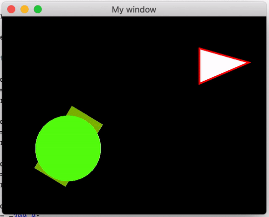

# Introduction to SFML

## Use of external libraries

Until now we used standard libraries provided with a set of development tools (SDK) for a given system. Using the library required only attaching an appropriate header file in the program code. Due to the fact that these were standard libraries, their location was known to the compiler.

Adding an external library requires modification of the project settings by indicating where the library is located. In addition, the SFML library that we attach will be provided in compiled form. This means that the header file will contain only function declarations, and their implementation is delivered in the form of files containing compiled code, which should be indicated to the *linker* in order to correctly build the project.

### Creating a project that uses SFML

We will use the Qt Creator environment that is configured with the GCC MinGW 7.3.0 for 64-bit architecture.

Download the current version of the SFML library from its developers (https://www.sfml-dev.org/download/sfml/2.5.1/). Select a version that is suitable for your system, compiler, and architecture (*GCC 7.3.0 MinGW (SEH) - 64-bit*). Unpack it to the desired location on your disk. This manual assumes that the library directory is placed directly on the `C:` drive.

Create a plain C++ application project. Place the content into `main.cpp` file with:

```cpp
#include <SFML/Window.hpp>
#include <SFML/Graphics.hpp>

int main() {
    // create the window
    sf::RenderWindow window(sf::VideoMode(800, 600), "My window");

    // create some shapes
    sf::CircleShape circle(100.0);
    circle.setPosition(100.0, 300.0);
    circle.setFillColor(sf::Color(100, 250, 50));

    sf::RectangleShape rectangle(sf::Vector2f(120.0, 60.0));
    rectangle.setPosition(500.0, 400.0);
    rectangle.setFillColor(sf::Color(100, 50, 250));

    sf::ConvexShape triangle;
    triangle.setPointCount(3);
    triangle.setPoint(0, sf::Vector2f(0.0, 0.0));
    triangle.setPoint(1, sf::Vector2f(0.0, 100.0));
    triangle.setPoint(2, sf::Vector2f(140.0, 40.0));
    triangle.setOutlineColor(sf::Color::Red);
    triangle.setOutlineThickness(5);
    triangle.setPosition(600.0, 100.0);

    // run the program as long as the window is open
    while (window.isOpen()) {
        // check all the window's events that were triggered since the last iteration of the loop
        sf::Event event;
        while (window.pollEvent(event)) {
            // "close requested" event: we close the window
            if (event.type == sf::Event::Closed)
                window.close();
        }

        // clear the window with black color
        window.clear(sf::Color::Black);

        // draw everything here...
        window.draw(circle);
        window.draw(rectangle);
        window.draw(triangle);

        // end the current frame
        window.display();
    }

    return 0;
}
```

Try to compile the project. **The compiler** will return an error if the header file `SFML/Window.h` is missing from the system paths it searches. 

## Adding SFML to qmake
Add the missing path to the project settings by modifying the `.pro` file describing the project:

```plaintext
INCLUDEPATH += "C:/SFML-2.5.1/include"
```

**ATTENTION**: All paths in `.pro` files should include a Linux-style slashes: `/` **NOT** `\` even though a Windows type system is used.

Enforce the processing of the `.pro` file by right-clicking on the project name in the tree and selecting *Run qmake*.

Try to compile the project again. This time, errors like *unresolved external symbol* will be returned by **linker** - the program "putting together" the final executable file from previously compiled fragments. This means that functions that were used in the program were found in the header files, but locating their compiled implementation failed - it is contained in the `*.lib` files provided with the library. Add additional linker parameters containing the path under which they can be found to the `*.pro` file, together with a list of files to be linked:

```plaintext
LIBS += -L"C:/SFML-2.5.1/lib"
CONFIG(debug, debug|release){
    LIBS += -lsfml-audio-d -lsfml-graphics-d -lsfml-network-d -lsfml-system-d -lsfml-window-d
} else {
    LIBS += -lsfml-audio -lsfml-graphics -lsfml-network -lsfml-system -lsfml-window
}
```

Restart *qmake*, then compile the project. The compilation should run without errors, but you will still not be able to run the program.

This is due to the fact that the libraries we have included in the project are not compiled into the executable file - they are dynamically linked (*DLL - Dynamic-Link Library*) and loaded from external files during startup. Thanks to this, they can be shared between many programs, which, in turn, are smaller in size. DLL files can be placed in system directories or in the directory where the executable file of the program is located (preferred way).

Copy the `.dll` files from the `bin` directory of the SFML library to the directory where the executable file (`exe`) of your application is located. In the Qt Creator environment, the default compilation directory is located next to the project directory and is named *build-<project_name>-<kit_name>-<build_type>*, e.g., *build-<project_name>-<release_name>*. For example, *build-sfml_hello-Desktop_Qt_5_10_1_MSVC2017_64bit-Debug*. Start the project. A properly working program should display the following window:


## Adding SFML to CMake
Open a terminal by holding ctl+alt+t
Install SFML library using command below
```
sudo apt-get install libsfml-dev
```
then open `CMakeLists.txt` in your project and add the below line befor ``` add_executable```
```
find_package(SFML 2.5 COMPONENTS system window graphics network audio REQUIRED)
```
and line below after ``` add_executable```
```
target_link_libraries(<Project-Name> sfml-graphics sfml-audio sfml-system sfml-network )

```
Don't forget to change ```<Project-Name>``` to the name of your project
## SFML library

SFML is a multi-platform library that facilitates the creation of programs that use two-dimensional graphics, e.g. simple games. It contains modules that allow you to generate graphics - drawing simple geometric figures with textures, keyboard/mouse input, sound and network operation.

The library API documentation can be found at the following address:
https://www.sfml-dev.org/documentation/2.5.1/

Tutorials describing the basic functionality are available below:
https://www.sfml-dev.org/tutorials/2.5/

All library resources are located in the namespace `sf`. To avoid cluttering the main namespace, we will stop using the `using namespace ...` directives, and instead precede the corresponding names with `sf::`, `std::`, and so on.

The example above shows a typical SFML application runtime. It includes the initialization of the window (class `sf::RenderWindow`) and the resources used in the program (in this case three shapes), and then performing a cyclical program loop, each course of which leads to the generation of one image frame, until the main window is closed.

Inside the loop, a queue of events (keystrokes, mouse movement, etc.) is checked, and an image frame is generated from the position: the "canvas" of the window is cleared, further objects are drawn, and finally the *framebuffer* is replaced.

---

#### 🛠🔥 Assignment 🔥🛠

Analyse how the sample code works. Change the size and layout of the elements on the scene, try to add more. What happens when you change the size of the window after starting the program? In what units are the sizes and position of objects on the scene expressed? 

---

## Time measurement, animations

The animation of objects involves displaying slightly modified object in each frame of the image (in each pass of the main loop) in order to get the impression of smooth movement.

In order for the animation of objects to be smooth and its speed independent of the number of frames per second displayed, we have to adjust the subsequent frames of the animation, for example, in one of the following ways:

* we can measure the time that has passed since the last frame was drawn and use this as a basis for determining the animation step;
* we can move objects from a separate thread at a fixed frequency;
* we can assume a fixed frame rate - in this case, if the computer does not keep up with the calculations or display, the animation will slow down.

In today's example we will use the first method. To measure the time we can use the class `sf::Clock`. It is a stopwatch clock that starts measuring time when an object is created. It allows you to read the elapsed time and restart measuring. See: [sf::Clock documentation](https://www.sfml-dev.org/documentation/2.5.1/classsf_1_1Clock.php).

Basic working example using `sf::Clock` in game logic:

```cpp
sf::Clock clock;
while (window.isOpen())
{
    sf::Time elapsed = clock.restart();

    ...
}
```

`sf::Clock::restart` method will zero the counter and return the `sf::Time` object representing time elapsed from the previous restart. See [sf::Time documentation](https://www.sfml-dev.org/documentation/2.5.1/classsf_1_1Time.php). Following methods can be used to extract time in different formats:

- [`sf::Time:asSeconds`](https://www.sfml-dev.org/documentation/2.5.1/classsf_1_1Time.php#aa3df2f992d0b0041b4eb02258d43f0e3),
- [`sf::Time::asMiliseconds`](https://www.sfml-dev.org/documentation/2.5.1/classsf_1_1Time.php#aa16858ca030a07eb18958c321f256e5a),
- [`sf::Time::asMicroseconds`](https://www.sfml-dev.org/documentation/2.5.1/classsf_1_1Time.php#a000c2c64b74658ebd228b9294a464275).

---

#### 🛠🔥 Assignment 🔥🛠

Refer to the documentation for `sf::Clock` class. Add the `sf::Clock` object to the program in such a way as to be able to measure the time between successive runs of the main loop. Display the time in the console in microseconds. How many frames per second does your program draw?

---

## Moving an object

All "drawable" objects in the SFML library have a set of methods allowing for their manipulation (transformations) on the screen plane - moving, scaling, rotating. The method to move *in relation to the current position* is `move(float offsetX, float offsetY)`.

---

#### 🛠🔥 Assignment 🔥🛠

Create two variables in the program that represent the speed of one of the objects - the horizontal (x) and vertical (y) components, e.g. `rectangle_velocity_x` and `rectangle_velocity_y`. They will denote the speed of the object in pixels per second. Give them values of 50 and 150 respectively.

Use the time calculated in the previous task and in each loop run move rectangular object with the `sf::Transformable::move` method by the distance that should be covered in the measured time at the set speed. **HINT**:


Then add the variable `rectangle_angular_velocity` describing the speed of rotation of the figure around its axis (in degrees per second) and give it a value of 10. Use the `rotate` method to cause the object to rotate.

**Note:** Unlike trigonometric functions in a standard library, functions in SFML operate at angles expressed in degrees.

---

## Simple collisions

Collision detection between objects on stage is the foundation of the mechanics of many games or applications that perform simple physics simulations. Since accurate collision calculations for many irregular objects would be very resource-intensive, some simplifications are used, such as approximating the shape of objects with a rectangle/circle (in a plane) or a cuboid (in 3D space).

The objects we have drawn have the `getGlobalBounds()` method, which returns the `sf::FloatRect` rectangle which is the outline of the figure, in the coordinates of the window. Usage example:

```cpp
sf::FloatRect rectangle_bounds = rectangle.getGlobalBounds();
std::cout << rectangle_bounds.top << " " << rectangle_bounds.left << " " ;
std::cout << rectangle_bounds.width << " " << rectangle_bounds.height << std::endl;
```

---

#### 🛠🔥 Assignment 🔥🛠

Using the contour of a rotating rectangle, write a set of conditions to verify that it touches one of the edges of the screen. If so, "bounce" it by changing the *return* speed in the correct direction depending on the wall the object is hitting. You can assume that window has fixed dimensions (or advanced check for current `window` size using `sf::RenderWindow::getSize` method).

---

## Colours

Colours in SFML are described in *RGB* (*red*, *green*, *blue*). Each color component is an 8-bit number without a character (0-255 range). This is a very common way of representing colour in computer graphics. It's sometimes called *RGB888* or *RGB 24-bit*.

The basic figures in SFML have a contour and fill colour.

For example:

```cpp
rectangle.setFillColor(sf::Color(255, 255, 0));
```

will change the colour of the filling of the rectangle to yellow.

---

#### 🛠🔥 Assignment 🔥🛠

Add a change of colour of the rectangle to a random colour after each bounce, so that the effect is similar to the one shown below:



---

---
Authors: *Tomasz Mańkowski*, *Jakub Tomczyński*, *Dominik Pieczyński*
