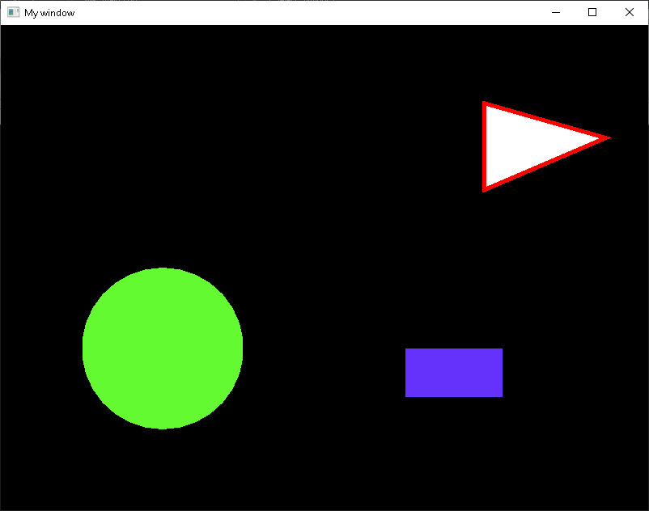
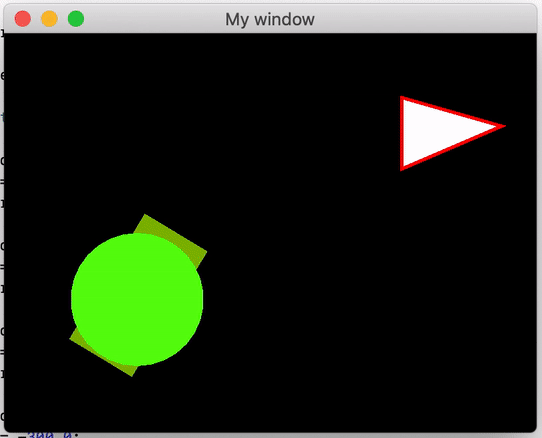

# Introduction to SFML

## Use of external libraries

Until now we used standard libraries provided with a set of development tools (SDK) for a given system. Using the library required only attaching an appropriate header file in the program code. Due to the fact that these were standard libraries, their location was known to the compiler.

Adding an external library requires modification of the project settings by indicating where the library is located. In addition, the SFML library that we attach will be provided in compiled form. This means that the header file will contain only function declarations, and their implementation is delivered in the form of files containing compiled code, which should be indicated to the *linker* in order to correctly build the project.

### Creating a project that uses SFML

Create a plain C++ application project. Place the content into `main.cpp` file with:

```cpp
#include <SFML/Window.hpp>
#include <SFML/Graphics.hpp>

int main() {
    sf::RenderWindow window(sf::VideoMode(sf::Vector2u(800, 600)), "My window");

    sf::CircleShape circle(100.0f);
    circle.setPosition(sf::Vector2f(100.0f, 300.0f));
    circle.setFillColor(sf::Color(100, 250, 50));

    sf::RectangleShape rectangle(sf::Vector2f(120.0f, 60.0f));
    rectangle.setPosition(sf::Vector2f(500.0f, 400.0f));
    rectangle.setFillColor(sf::Color(100, 50, 250));

    sf::ConvexShape triangle;
    triangle.setPointCount(3);
    triangle.setPoint(0, sf::Vector2f(0.0f, 0.0f));
    triangle.setPoint(1, sf::Vector2f(0.0f, 100.0f));
    triangle.setPoint(2, sf::Vector2f(140.0f, 40.0f));
    triangle.setOutlineColor(sf::Color::Red);
    triangle.setOutlineThickness(5);
    triangle.setPosition(sf::Vector2f(600.0f, 100.0f));

    while (window.isOpen()) {
        while (auto event = window.pollEvent()) {
            if (event->is<sf::Event::Closed>())
                window.close();
        }

        window.clear(sf::Color::Black);

        window.draw(circle);
        window.draw(rectangle);
        window.draw(triangle);

        window.display();
    }

    return 0;
}
```

Try to compile the project. **The compiler** will return an error if the header file `SFML/Window.h` is missing from the system paths it searches. 


## Adding SFML (Windows)

This setup uses precompiled SFML binaries and VS Code configuration. It does **not** use MSYS2 or terminal commands on Windows.

Download SFML from the official website (https://www.sfml-dev.org/download/), then choose the package that matches your compiler and architecture. In this course we use **MinGW 64-bit**, so pick the matching **GCC MinGW** package (not MSVC).

Extract the archive to a fixed path, for example:

```plaintext
C:\libs\SFML-3.0.2
```

Make sure this folder contains:

- `C:\libs\SFML-3.0.2\include\SFML`
- `C:\libs\SFML-3.0.2\lib`
- `C:\libs\SFML-3.0.2\bin`

After that, modify `tasks.json`:

```json
{
    "tasks": [
        {
            "type": "cppbuild",
            "label": "C/C++: g++ build active file",
            "command": "C:/Qt/Tools/mingw1310_64/bin/g++.exe",
            "args": [
                "-fdiagnostics-color=always",
                "-g",
                "-std=c++17",
                "${workspaceFolder}/*.cpp",
                "-o",
                "${workspaceFolder}/app.exe",
                "-IC:/libs/SFML-3.0.2/include",
                "-LC:/libs/SFML-3.0.2/lib",
                "-lsfml-graphics",
                "-lsfml-window",
                "-lsfml-system"
            ],
            "options": {
                "cwd": "${workspaceFolder}"
            },
            "problemMatcher": [
                "$gcc"
            ],
            "group": {
                "kind": "build",
                "isDefault": true
            },
            "detail": "Task generated by Debugger."
        }
    ],
    "version": "2.0.0"
}
```

Now modify `launch.json` so VS Code can find SFML `.dll` files during debug:

```json
{
    "configurations": [
        {
            "name": "C/C++: g++ build and debug active file",
            "type": "cppdbg",
            "request": "launch",
            "program": "${workspaceFolder}/app.exe",
            "args": [],
            "stopAtEntry": false,
            "cwd": "${workspaceFolder}",
            "environment": [
                {
                    "name": "PATH",
                    "value": "C:/libs/SFML-3.0.2/bin;${env:PATH}"
                }
            ],
            "externalConsole": false,
            "MIMode": "gdb",
            "setupCommands": [
                {
                    "description": "Enable pretty-printing for gdb",
                    "text": "-enable-pretty-printing",
                    "ignoreFailures": true
                },
                {
                    "description": "Set Disassembly Flavor to Intel",
                    "text": "-gdb-set disassembly-flavor intel",
                    "ignoreFailures": true
                }
            ],
            "preLaunchTask": "C/C++: g++ build active file",
            "miDebuggerPath": "C:/Qt/Tools/mingw1310_64/bin/gdb.exe"
        }
    ],
    "version": "2.0.0"
}
```

If your MinGW path is different, update both `g++.exe` and `gdb.exe` paths accordingly. If your SFML folder name is different, update all `C:/libs/SFML-3.0.2/...` paths.

After these changes you should be able to build and run SFML code on Windows without MSYS2.


## Adding SFML (Linux)

Check if SFML is already installed on your system by running the following command in the terminal:

```bash
ls /opt/sfml-3/lib | grep sfml
```

if you see files with `sfml` in their name, it means that the library is already installed and you can skip the next step and move to modifying `task.json` and `launch.json` files. If not, you need to install the library first.

Download SFML from the official repository. To do it, run the following commands in the terminal (`ctrl + alt + t` to open it and `ctrl + shift + v` to paste the commands):

```bash
sudo apt-get install -y wget build-essential cmake pkg-config libx11-dev libxrandr-dev \
libudev-dev libgl1-mesa-dev libfreetype6-dev libjpeg-dev libopenal-dev \
libflac-dev libvorbis-dev libogg-dev
git clone https://github.com/SFML/SFML.git
cd SFML
git checkout 3.0.x
mkdir build
cd build
cmake .. -DCMAKE_BUILD_TYPE=Release -DBUILD_SHARED_LIBS=ON
cmake --build . --config Release --parallel
sudo cmake --install . --prefix=/opt/sfml-3
ls /opt/sfml-3/lib | grep sfml

```

After that, modify `task.json` to include the path to the SFML installation, like this:

```json
{
    "tasks": [
        {
            "type": "cppbuild",
            "label": "C/C++: g++ build active file",
            "command": "/usr/bin/g++",
            "args": [
                "-fdiagnostics-color=always",
                "-g",
                "-std=c++17",
                "${file}",
                "-o",
                "${workspaceFolder}/app",
                "-I",
                "/opt/sfml-3/include",
                "-L",
                "/opt/sfml-3/lib",
                "-Wl,-rpath,/opt/sfml-3/lib",
                "-lsfml-graphics",
                "-lsfml-window",
                "-lsfml-system"
            ],
            "options": {
                "cwd": "${workspaceFolder}"
            },
            "problemMatcher": [ 
                "$gcc"
            ],
            "group": {
                "kind": "build",
                "isDefault": true
            },
            "detail": "Task generated by Debugger."
        }
    ],
    "version": "2.0.0"
}

```

Keep in mind that the line `"-Wl,-rpath,/opt/sfml-3/lib",` must match the SFML installation path. If you install SFML in a different directory, update the include path, library path, rpath, and `LD_LIBRARY_PATH` accordingly.

Next, modify `launch.json` to include the path to the SFML library:

```json
{
    "configurations": [
        {
            "name": "C/C++: g++ build and debug active file",
            "type": "cppdbg",
            "request": "launch",
            "program": "${workspaceFolder}/app",
            "args": [],
            "stopAtEntry": false,
            "cwd": "${workspaceFolder}",
            "environment": [
                {
                    "name": "LD_LIBRARY_PATH",
                    "value": "/opt/sfml-3/lib:${env:LD_LIBRARY_PATH}"
                }
            ],
            "externalConsole": false,
            "MIMode": "gdb",
            "setupCommands": [
                {
                    "description": "Enable pretty-printing for gdb",
                    "text": "-enable-pretty-printing",
                    "ignoreFailures": true
                },
                {
                    "description": "Set Disassembly Flavor to Intel",
                    "text": "-gdb-set disassembly-flavor intel",
                    "ignoreFailures": true
                }
            ],
            "preLaunchTask": "C/C++: g++ build active file",
            "miDebuggerPath": "/usr/bin/gdb"
        }
    ],
    "version": "2.0.0"
}

```

After these modifications, you should be able to compile and run the program.


## Adding SFML (MacOS)

First install sfml.

```bash
brew install sfml
```

On apple intel it is installed in,
```bash
/usr/local/opt/sfml
```
and on apple silicon in,
```bash
/opt/homebrew/opt/sfml
```

After installation we have to modify `task.json`. We have to add information about c++ standard `-std=c++17` and include and link libraries `-I<installation_path>/include`, `-L<installation_path>/lib`, `-lsfml-graphics`, `-lsfml-window`, `-lsfml-system`. So the modified file should look similarly to this:

```json
{
    "tasks": [
        {
            "type": "cppbuild",
            "label": "C/C++: clang build active file",
            "command": "/usr/bin/clang++",
            "args": [
                "-fcolor-diagnostics",
                "-fansi-escape-codes",
                "-std=c++17",
                "-g",
                "${workspaceFolder}/*.cpp",
                "-I/opt/homebrew/opt/sfml/include",
                "-L/opt/homebrew/opt/sfml/lib",
                "-lsfml-graphics",
                "-lsfml-window",
                "-lsfml-system",
                "-o",
                "${fileDirname}/${fileBasenameNoExtension}"
            ],
            "options": {
                "cwd": "${fileDirname}"
            },
            "problemMatcher": [
                "$gcc"
            ],
            "group": {
                "kind": "build",
                "isDefault": true
            },
            "detail": "Task generated by Debugger."
        }
    ],
    "version": "2.0.0"
}
```

It is not necessary but recommended to add `c_cpp_properties.json` in `.vscode` folder. This files tells IntelliSense where to search for libraries and makes autocompleation work. In this new file paste:

```json
{
    "configurations": [
        {
            "name": "Mac",
            "includePath": [
                "${workspaceFolder}/**",
                "/opt/homebrew/opt/sfml/include"
            ],
            "defines": [],
            "compilerPath": "/usr/bin/clang++",
            "cStandard": "c17",
            "cppStandard": "c++17",
            "intelliSenseMode": "macos-clang-arm64"
        }
    ],
    "version": 4
}
```
Now you can try and compile the code.

## Final result

After succesfull compilaiton you should see the rendered image as follows.



## SFML library

SFML is a multi-platform library that facilitates the creation of programs that use two-dimensional graphics, e.g. simple games. It contains modules that allow you to generate graphics - drawing simple geometric figures with textures, keyboard/mouse input, sound and network operation.

The library API documentation can be found at the following address:
https://www.sfml-dev.org/documentation/3.0.2/

Tutorials describing the basic functionality are available below:
https://www.sfml-dev.org/tutorials/3.0/

All library resources are located in the namespace `sf`. To avoid cluttering the main namespace, we will stop using the `using namespace ...` directives, and instead precede the corresponding names with `sf::`, `std::`, and so on.

The example above shows a typical SFML application runtime. It includes the initialization of the window (class `sf::RenderWindow`) and the resources used in the program (in this case three shapes), and then performing a cyclical program loop, each course of which leads to the generation of one image frame, until the main window is closed.

Inside the loop, a queue of events (keystrokes, mouse movement, etc.) is checked, and an image frame is generated from the position: the "canvas" of the window is cleared, further objects are drawn, and finally the *framebuffer* is replaced.

---

#### 🛠🔥 Assignment 🔥🛠

Analyse how the sample code works. Change the size and layout of the elements on the scene, try to add more. What happens when you change the size of the window after starting the program? In what units are the sizes and position of objects on the scene expressed? 

---

## Time measurement, animations

The animation of objects involves displaying slightly modified object in each frame of the image (in each pass of the main loop) in order to get the impression of smooth movement.

In order for the animation of objects to be smooth and its speed independent of the number of frames per second displayed, we have to adjust the subsequent frames of the animation, for example, in one of the following ways:

* we can measure the time that has passed since the last frame was drawn and use this as a basis for determining the animation step;
* we can move objects from a separate thread at a fixed frequency;
* we can assume a fixed frame rate - in this case, if the computer does not keep up with the calculations or display, the animation will slow down.

In today's example we will use the first method. To measure the time we can use the class `sf::Clock`. It is a stopwatch clock that starts measuring time when an object is created. It allows you to read the elapsed time and restart measuring. See: [sf::Clock documentation](https://www.sfml-dev.org/documentation/3.0.2/classsf_1_1Clock.php).

Basic working example using `sf::Clock` in game logic:

```cpp
sf::Clock clock;
while (window.isOpen())
{
    sf::Time elapsed = clock.restart();

    ...
}
```

`sf::Clock::restart` method will zero the counter and return the `sf::Time` object representing time elapsed from the previous restart. See [sf::Time documentation](https://www.sfml-dev.org/documentation/3.0.2/classsf_1_1Time.html). Following methods can be used to extract time in different formats:

- [`sf::Time::asSeconds`](https://www.sfml-dev.org/documentation/3.0.2/classsf_1_1Time.html#a0284a68194143e17451b9fd2c9292518),
- [`sf::Time::asMiliseconds`](https://www.sfml-dev.org/documentation/3.0.2/classsf_1_1Time.html#a94ca72624d95cf0c2fef2ed52c4a42f8),
- [`sf::Time::asMicroseconds`](https://www.sfml-dev.org/documentation/3.0.2/classsf_1_1Time.html#a7617b1387d7b3a6f8c7019155aa25ccc).

---

#### 🛠🔥 Assignment 🔥🛠

Refer to the documentation for `sf::Clock` class. Add the `sf::Clock` object to the program in such a way as to be able to measure the time between successive runs of the main loop. Display the time in the console in microseconds. How many frames per second does your program draw?

---

## Moving an object

All "drawable" objects in the SFML library have a set of methods allowing for their manipulation (transformations) on the screen plane - moving, scaling, rotating. The method to move *in relation to the current position* is `move(sf::Vector2f(float offsetX, float offsetY))`.

---

#### 🛠🔥 Assignment 🔥🛠

Create two variables in the program that represent the speed of one of the objects - the horizontal (x) and vertical (y) components, e.g. `rectangle_velocity_x` and `rectangle_velocity_y`. They will denote the speed of the object in pixels per second. Give them values of 50 and 150 respectively.

Use the time calculated in the previous task and in each loop run move rectangular object with the `sf::Transformable::move` method by the distance that should be covered in the measured time at the set speed. **HINT**:


Then add the variable `rectangle_angular_velocity` describing the speed of rotation of the figure around its axis (in degrees per second) and give it a value of 10. Use the `rotate(sf::degrees(float degrees))` method to cause the object to rotate.

---

## Simple collisions

Collision detection between objects on stage is the foundation of the mechanics of many games or applications that perform simple physics simulations. Since accurate collision calculations for many irregular objects would be very resource-intensive, some simplifications are used, such as approximating the shape of objects with a rectangle/circle (in a plane) or a cuboid (in 3D space).

The objects we have drawn have the `getGlobalBounds()` method, which returns the `sf::FloatRect` rectangle which is the outline of the figure, in the coordinates of the window. Usage example:

```cpp
sf::FloatRect rectangle_bounds = rectangle.getGlobalBounds();
std::cout << "Top left corner coordinates are: " << rectangle_bounds.position.x << " " << rectangle_bounds.position.y << " " ;
std::cout << "Size od the rectangle is: " << rectangle_bounds.size.x << " " << rectangle_bounds.size.y << std::endl;
```

---

#### 🛠🔥 Assignment 🔥🛠

Using the contour of a rotating rectangle, write a set of conditions to verify that it touches one of the edges of the screen. If so, "bounce" it by changing the *return* speed in the correct direction depending on the wall the object is hitting. You can assume that window has fixed dimensions (or advanced check for current `window` size using `sf::RenderWindow::getSize` method).

---

## Colours

Colours in SFML are described in *RGB* (*red*, *green*, *blue*). Each color component is an 8-bit number without a character (0-255 range). This is a very common way of representing colour in computer graphics. It's sometimes called *RGB888* or *RGB 24-bit*.

The basic figures in SFML have a contour and fill colour.

For example:

```cpp
rectangle.setFillColor(sf::Color(255, 255, 0));
```

will change the colour of the filling of the rectangle to yellow.

---

#### 🛠🔥 Assignment 🔥🛠

Add a change of colour of the rectangle to a random colour after each bounce, so that the effect is similar to the one shown below:



---

---
Authors: *Tomasz Mańkowski*, *Jakub Tomczyński*, *Dominik Pieczyński*
