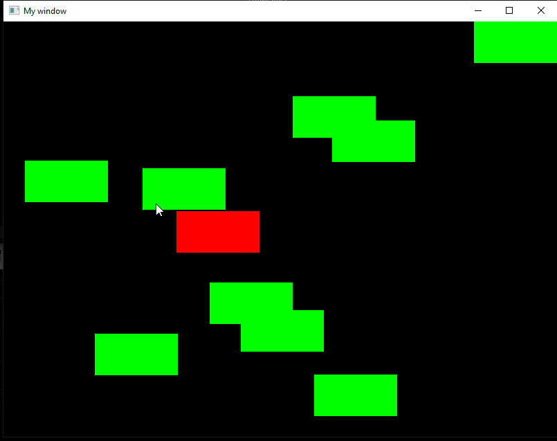

# Inheritance and events handling in SFML

## Initializer list

Initializer list can be used, with a constructor, to write values into data members of the class. Field to be initialized are listed after a colon, separated by a comma. This allows not to assign values passed by a constructor parameters inside a constructor body. In this case it is used for code clarity and also impacts performance. E.g.:

```cpp
class Fluid {

public:
    Fluid(const std::string &type, const double density) : m_type(type), m_density(density)
    {

    }

private:
    std::string m_type;
    double m_density;
};

int main()
{
    Fluid water("Water", 997);
}
```

Initializer lists play also a significant role in inheritance of classes, which will be described below.

## Inheritance

We already prepared some classes that described some real-life entities (the `Student` class can be an example). Some entities in real life stay in relations. For example cars, motorcycles, scooters and bikes are all different kinds of vehicles. It means that all of them have some common properties. In object-oriented programming we would tell that  `Car`, `Motorcycle`, `Scooter` and `Bike` classes inherit `Vehicle` properties. The described mechanism is called *inheritance* and it allows us to describe some hierarchical relations, but, most importantly, it allows as to define some common interface that multiple classes should implement, while avoiding unnecessary code duplication.

Let's take a look at an example base class:

```cpp
class Vehicle {

public:
    std::string name() { return name_; }
    int number_of_wheels() { return number_of_wheels_; }
    std::string propulsion_type() { return propulsion_type_; }
    double max_speed() { return max_speed_; }

protected:
    Vehicle(const std::string &name, int number_of_wheels,
            const std::string &propulsion_type, double max_speed)
      : name_(name), number_of_wheels_(number_of_wheels),
        propulsion_type_(propulsion_type), max_speed_(max_speed) {}

    std::string name_;
    int number_of_wheels_;
    std::string propulsion_type_;
    double max_speed_;
};
```

### `protected` access modifier

Most importantly, the `Vehicle` class uses new access modifier called `protected`. It behaves like the `private` modifier (disables access from outside of the class), but what's different is that it allows classes that inherit the base class to access the properties/methods, while `private` does not. The table below describes how different modifiers work in classes:

|                    Access | public | protected | private |
|:--------------------------:|:------:|:---------:|:-------:|
| members of the same class |   yes  |    yes    |   yes   |
|  members of derived class |   yes  |    yes    |    no   |
|               non-members |   yes  |     no    |    no   |

You can notice that the constructor of the `Vehicle` class is marked as `protected`. This is done because we don't want to create the objects of `Vehicle` class directly. We will rather use the classes that inherit it.

### Inheritance statement

The first example that inherits the `Vehicle` class is the `Bike` class:

```cpp
class Bike : public Vehicle {

public:
    Bike() : Vehicle("Bike", 2, "Muscles", 30) {}
};
```

### Class access specifier

Base classes are listed following a colon during class declaration. We can see that it inherits the `Vehicle` class with `public` modifier. When inheriting classes the modifiers have the following effects:

* `public`: the public and protected members of the base class listed after the specifier keep their access level in the derived class,
* `protected`: the public and protected members of the base class listed after the specifier become protected members of the derived class,
* `private`: the public and protected members of the base class listed after the specifier become private members of the derived class.

### Initializer list in calling base-class constructor

The `Bike` class defines a constructor without arguments that always calls the `Vehicle` constructor with the same parameters (`Bike() : Vehicle("Bike", 2, "Muscles", 30) {}`). The constructor of the base class (`Vehicle`) is called using a initializer list, this is a requirement as no default constructor (with no parameters) of the base class exist. Need of initializer list usage forces the programmer always to specify with base-class constructor and specify its parameters, as the knowledge of base class object initialization has to be known.

We make some assumptions about the bikes: they don't have any special names, always have two wheels, don't use propulsion mechanisms other than human muscles and achieve the maximum speed of 30 units. This class doesn't add any functionality to the one the base class offers. We can call base class getters to read the properties of the base class:

```cpp
Bike bike;
std::cout << bike.max_speed() << std::endl; // Will print 30
```

We can also define another derived class - `Car`:

```cpp
class Car : public Vehicle {

public:
    Car(const std::string &name, const std::string &propulsion_type,
        double max_speed, bool has_abs)
        : Vehicle(name, 4, propulsion_type, max_speed),
          has_abs_(has_abs) {}

    bool has_abs() { return has_abs_; }

private:
    bool has_abs_;
};
```

This one is slightly more complex. It has constructors that takes some arguments and passes them to the base class constructor, while filling some others with constant values (like four wheels). It also initializes additional field of that class: `bool has_abs_`. This is an additional property that is not common for all vehicles, but specific to cars.

We can access both the inherited and additional properties after constructing a `Car` object:

```cpp
Car passat("Volkswagen Passat", "Diesel", 200, true);
std::cout << "Name: " << passat.name() << std::endl;
std::cout << "Has ABS: " << passat.has_abs() << std::endl;
```

### Inheritance from multiple classes

The class that we write can also inherit properties and methods from multiple classes. In such case we just need to write other base classes names after the class name in the declaration. For example: `class Car : public Object, public Vehicle`.

Of course we only scratched the surface of inheritance possibilities and applications with those examples. People usually use inheritance with virtual functions, polymorphism and polymorphic containers (containers that can store pointers to objects of different types that have common base class).

---

#### 🛠🔥 Assignment 🔥🛠

Prepare another classes that inherit from the `Vehicle` base class. For each new class specify object witch proper constructors (you can even prepare alternative constructors), add fields specific to the derived class objects. Show the usage of the derived classes. Prepare at least 3 examples of `Vehicle` derived classes. Examples can include object like:

- Tractor,
- Motorcycle,
- Plane,
- Helicopter,
- ...

You can also consider making your `Vehicle`-derived class a base class for next classes. E.g. you can create `Aircraft` class derived from `Vehicle` containing flying-specific information, than `Plane` and `Helicopter` can inherit the `Aircraft`, not the `Vehicle` directly.

---

## Inheritance of SFML objects

As one would expect SFML is an class-based library, thus we can crate classes inherit from SFML objects (e.g. `sf::RectangleShape`) and add new functionalities to the objects, specific to our program and implementation.

---

#### 🛠🔥 Assignment 🔥🛠

Create `CustomRectangleShape` class which will inherit the `sf::RectangleShape` SFML class and extend it functionality:

1. Creation of the `CustomRectangleShape` should be possible as following:

```cpp
sf::Vector2f size(120.0, 60.0);
sf::Vector2f position(120.0, 60.0);
CustomRectangleShape rectangle(size, position);
```

**HINT**: Remember that inside a derived object of `CustomRectangleShape` you have direct access to the public fields and methods of `sf::RectangleShape` base class, so for example you can directly call `setPosition(position);` inside the constructor of your derived class. Remember to call the `sf::RectangleShape` construct in the initializer list, with size parameter.

**HINT 2**: If you use `public` access specifier when inheriting `sf::RectangleShape` class all the public methods of base class can be called on your derived object, e.g.:

```cpp
rectangle.setFillColor(sf::Color(100, 50, 250));
```

2. Add private fields representing vertical and horizontal speed, and speed of rotation. Add public method allowing for setting of this values:

```cpp
rectangle.setSpeed(100, 150, 10);
```

**HINT**: In classes each filed can be declared with a default value, so its assigned with it on object creation. Give your speed fields default values of 0. E.g.:

```cpp
private:
    int m_speed_x = 0;
```

3. Add a public `void animate(const sf::Time &elapsed)` method to `CustomRectangleShape`, taking time elapsed between its call as an argument. Inside perform a step of animation( translation and rotation). The *main loop* of the program should call the `animate` method in order to advance the animation. E.g.:

```cpp
window.clear(sf::Color::Black);

sf::Time elapsed = clock.restart();

rectangle.animate(elapsed);

window.draw(rectangle);
window.display();
```

4. To `CustomRectangleShape` add private fields (with default values) representing left, right, top, and bottom bounds for the rectangle to be contained within. Add public method allowing for setting of this values:

```cpp
rectangle.setBounds(0, window.getSize().x, 0, window.getSize().y);
```

5. Add a **private** method `void bounce()` which will implement the collision of the represented rectangle with defined bounds. When the object hits the bound modify its vertical or horizontal speed in order to change the direction of the animation. **HINT**: Use `abs()`, do not multiply the speed by -1, in order to avoid the object to stuck behind the bounds and crash the collision.

6. Add instances of `CustomRectangleShape`, animate it.

---

## Events handling in SFML

Most computer games need to react to some external events - mainly those generated by keyboard or mouse. Pressing some keyboard key as well as moving a mouse is an event. The SFML library supports [different kinds of events](https://www.sfml-dev.org/documentation/2.5.1/classsf_1_1Event.php) through special classes for different devices.

For the keyboard and mouse SFML offers [sf::Keyboard](https://www.sfml-dev.org/documentation/2.5.1/classsf_1_1Keyboard.php) and [sf::Mouse](https://www.sfml-dev.org/documentation/2.5.1/classsf_1_1Mouse.php) classes. They are static, which means that we cannot create objects from them - they only have one, global instance with one, shared state. This is because even if there are multiple mice or keyboards connected to the computer, the application only sees a single event source - the operating system.

If a key press, or any other event has to be a part of animation a check of the key press/hold is needed in every frame of the animation, this can be done in following way:

```cpp
if(sf::Keyboard::isKeyPressed(sf::Keyboard::Up))
{
    std::cout << "Holding up button" << std::endl;
}

if(sf::Mouse::isButtonPressed(sf::Mouse::Middle))
{
    std::cout << "Holding middle mouse button" << std::endl;
}
```

Example for handling events can be found below. A event queue is used to handle all the events occurred during a current program/window loop. A `sf::Window::pollEvent` method is used to dequeue subsequent events, then a type of event can be check end handled properly. This procedure can be used for detecting single events like a press or release of key or mouse button. For example the event will not reoccur when the mouse button is hold. This can be used for situation, where clicking something needs to evoke an action only once:

```cpp
sf::Event event;
while (window.pollEvent(event)) {
    // "close requested" event: we close the window
    if(event.type == sf::Event::Closed)
    {
        std::cout << "Closing Window" << std::endl;
        window.close();
    }

    if(event.type == sf::Event::KeyReleased)
    {
        if(event.key.code == sf::Keyboard::Space)
            std::cout << "Space released" << std::endl;
    }

    if(event.type == sf::Event::MouseButtonPressed)
    {
        if(event.mouseButton.button == sf::Mouse::Left)
        {
            sf::Vector2i mouse_pos = sf::Mouse::getPosition(window);
            std::cout << "Mouse clicked: " << mouse_pos.x << ", " << mouse_pos.y << std::endl;

        }
    }
}
```

## Final assignments 🔥🛠

#### 1. Moving the rectangle with keyboard

Backup your work, this task will change elements in the code needed for previous assignment.

- Add a public method `void moveInDirection(const sf::Time &elapsed, const sf::Keyboard::Key &key)` to `CustomRectangleShape`, this will move the rectangle not by itself, but cause it to react to keyboard press. When user presses any arrow on the keyboard the rectangle should move in the chosen direction with the speed that is stored in the class field. **HINT:** Remember to delete the `animate` method call for the rectangle object.

- Prevent the rectangle from going outside of the bounds.

- Add a public method `bool isClicked(sf::Vector2i &mouse_position) const` which will return `true` if the passed mouse pointer coordinates are within the bounding box of the rectangle. Use this method in mouse press event handling procedure and change its colour to random when clicked.

#### 2. Moving selected rectangle

Backup your work, this task will change elements in the code needed for previous assignment.

- Add multiple rectangles with random positions (but inside the window boundaries) to the scene. **HINT:** For ease of use and code clarity lets create a vector of `CustomRectangleShape` to store all the objects. Than we can use a simple for in range to go through all the objects:

```cpp
std::srand(std::time(nullptr));

std::vector<CustomRectangleShape> rectangles;

for(int i=0; i<10; i++)
{
    sf::Vector2f size(120.0, 60.0);
    sf::Vector2f position(std::rand() % (window.getSize().x - 120), std::rand() % (window.getSize().y - 60));
    rectangles.emplace_back(CustomRectangleShape(size, position));
}

for(auto &rec : rectangles)
{
    rec.setFillColor(sf::Color(0, 255, 0));
    rec.setBounds(0, window.getSize().x, 0, window.getSize().y);
    rec.setSpeed(100, 200, 10);
}

while (window.isOpen()) {

[...]

    for(auto &rec : rectangles)
    {
        window.draw(rec);
    }

    window.display();
}
```

- Change the previous code to allow the use of a mouse to select the rectangle that will move when arrows are pressed on a keyboard. When the user selects a rectangle it should be highlighted with different colour than the other ones. After selecting another rectangle the highlighting should disappear from the previous one.

**HINT:** You need to add additional private field and setter to your `CustomRectangleShape` class to keep the rectangle informed about being currently selected. Remember to give it an initial default value.



---
Authors: *Dominik Pieczyński*, *Jakub Tomczyński*
