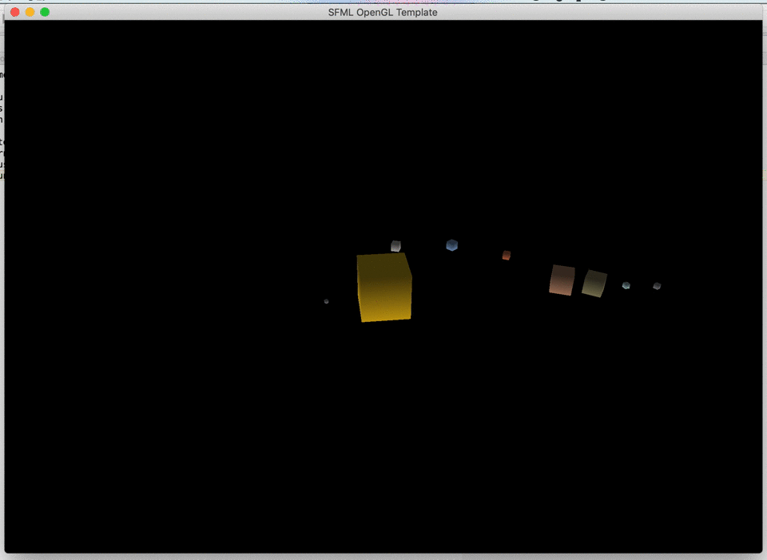

# OpenGL

## OpenGL and GLU in SFML

OpenGL is an open, low-level API for generating 3D graphics. Since the SFML library uses OpenGL internally to draw 2D graphics, we can use it as an helper library to facilitate, for example, the creation of a window and support for input events.

OpenGL provides functions such as drawing single polygons or series of polygons and their transformations. Slightly more high-level functions are part of the GLU library (GL Utility Library).

Since we will use OpenGL and GLU functions directly, it is necessary to include them in the list of libraries for the linker parameters. In addition to SFML libraries linking described in [Lab 03 - introduction to SFML](./Lab 03 - introduction to SFML.html) it is necessary to add yet another line to the `.pro` file:

```plaintext
LIBS += -lOpenGL32 -lglu32
```

### First OpenGL + SFML program

Create a project to work with SFML and OpenGL. Place the `main.cpp` file in the project with the content below:

```cpp
#define GL_SILENCE_DEPRECATION

#include <SFML/Window.hpp>
#include <SFML/OpenGL.hpp>

#ifdef __APPLE__
#include <OpenGL/glu.h> // macOS
#else
#include <GL/glu.h> // Windows/Linux
#endif

void draw_cube(double size) {
    double half_cube_size = size / 2.0;

    // bottom
    glBegin(GL_POLYGON);
    glVertex3d(-half_cube_size, half_cube_size, -half_cube_size);
    glVertex3d(half_cube_size, half_cube_size, -half_cube_size);
    glVertex3d(half_cube_size, -half_cube_size, -half_cube_size);
    glVertex3d(-half_cube_size, -half_cube_size, -half_cube_size);
    glEnd();

    // top
    glColor3d(1.0, 0.0, 0.0);
    glBegin(GL_POLYGON);
    glVertex3d(-half_cube_size, half_cube_size, half_cube_size);
    glVertex3d(half_cube_size, half_cube_size, half_cube_size);
    glVertex3d(half_cube_size, -half_cube_size, half_cube_size);
    glVertex3d(-half_cube_size, -half_cube_size, half_cube_size);
    glEnd();

    // left
    glColor3d(0.0, 1.0, 0.0);
    glBegin(GL_POLYGON);
    glVertex3d(-half_cube_size, -half_cube_size, half_cube_size);
    glVertex3d(-half_cube_size, half_cube_size, half_cube_size);
    glVertex3d(-half_cube_size, half_cube_size, -half_cube_size);
    glVertex3d(-half_cube_size, -half_cube_size, -half_cube_size);
    glEnd();

    // right
    glColor3d(0.0, 0.0, 1.0);
    glBegin(GL_POLYGON);
    glVertex3d(half_cube_size, -half_cube_size, half_cube_size);
    glVertex3d(half_cube_size, half_cube_size, half_cube_size);
    glVertex3d(half_cube_size, half_cube_size, -half_cube_size);
    glVertex3d(half_cube_size, -half_cube_size, -half_cube_size);
    glEnd();

    // front
    glColor3d(1.0, 1.0, 0.0);
    glBegin(GL_POLYGON);
    glVertex3d(-half_cube_size, -half_cube_size, half_cube_size);
    glVertex3d(half_cube_size, -half_cube_size, half_cube_size);
    glVertex3d(half_cube_size, -half_cube_size, -half_cube_size);
    glVertex3d(-half_cube_size, -half_cube_size, -half_cube_size);
    glEnd();

    // back
    glColor3d(0.0, 1.0, 1.0);
    glBegin(GL_POLYGON);
    glVertex3d(-half_cube_size, half_cube_size, half_cube_size);
    glVertex3d(half_cube_size, half_cube_size, half_cube_size);
    glVertex3d(half_cube_size, half_cube_size, -half_cube_size);
    glVertex3d(-half_cube_size, half_cube_size, -half_cube_size);
    glEnd();
}

void set_viewport(int width, int height) {
    const float ar = (float)width / (float)height;

    glViewport(0, 0, width, height);

    glMatrixMode(GL_PROJECTION);
    glLoadIdentity();
    glFrustum(-ar, ar, -1.0, 1.0, 2.0, 100.0);
    gluLookAt(0, -5, 3, 0, 0, 0, 0, 0, 1);

//    glMatrixMode(GL_MODELVIEW);
//    glLoadIdentity();
}

int main() {
    // create the window
    sf::Window window(sf::VideoMode(1024, 768), "SFML OpenGL Template", sf::Style::Default, sf::ContextSettings(32));
    window.setVerticalSyncEnabled(true);

    // activate the window
    window.setActive(true);

    // set viewport according to current window size
    set_viewport(window.getSize().x, window.getSize().y);

    glClearColor(0, 0, 0, 1);

    glEnable(GL_DEPTH_TEST);
    glEnable(GL_SMOOTH);
    glShadeModel(GL_SMOOTH);

    // setup lights

    GLfloat light_position[] = { 2.0, 0.0, 2.0, 1.0 };
    GLfloat light_ambient[] = { 0.0, 0.0, 0.0, 1.0 };
    GLfloat light_diffuse[] = { 0.8, 0.8, 0.8, 1.0 };
    GLfloat light_specular[] = { 0.0, 0.0, 0.0, 1.0 };

    glLightfv( GL_LIGHT0, GL_POSITION, light_position);
    glLightfv( GL_LIGHT0, GL_AMBIENT, light_ambient);
    glLightfv( GL_LIGHT0, GL_DIFFUSE, light_diffuse);
    glLightfv( GL_LIGHT0, GL_SPECULAR, light_specular);
    glEnable( GL_LIGHTING );
    glEnable( GL_LIGHT0 );

    GLfloat global_ambient[] = {0.3, 0.3, 0.3, 0.1};
    glLightModelfv(GL_LIGHT_MODEL_AMBIENT, global_ambient);

    glEnable(GL_NORMALIZE) ;

    // load resources, initialize the OpenGL states, ...

    // run the main loop
    bool running = true;

    sf::Clock clk;

    while (running) {
        // handle events
        sf::Event event;
        while (window.pollEvent(event)) {
            if (event.type == sf::Event::Closed) {
                // end the program
                running = false;
            } else if (event.type == sf::Event::Resized) {
                // adjust the viewport when the window is resized
                set_viewport(event.size.width, event.size.height);
            }
        }

        // clear the buffers
        glClear(GL_COLOR_BUFFER_BIT | GL_DEPTH_BUFFER_BIT);
        glColorMaterial (GL_FRONT_AND_BACK, GL_AMBIENT_AND_DIFFUSE) ;
        glEnable (GL_COLOR_MATERIAL);

        // draw stuff

        glPushMatrix();

        float rot = clk.getElapsedTime().asSeconds() * 90;

        // TODO
        // test functions below (glTranslated, glRotated, glColor3d)
        // what happens when you change their arguments?
        // does their order change the result?

        glTranslated(0.0, 0.0, 0.0);
        glRotated(0, 1.0, 0.0, 0.0);
        glRotated(0, 0.0, 1.0, 0.0);
        glRotated(rot, 0.0, 0.0, 1.0);

        glScaled(1.0, 1.0, 1.0);

        draw_cube(2.0);

        glPopMatrix();

        // end the current frame (internally swaps the front and back buffers)
        window.display();
    }

    return 0;
```

---

#### 🛠🔥 Assignment 🔥🛠

Start the program. A rotating colorous cube should appear on the screen.

---

The code structure of the program is analogous to previous SFML programs - the environment is initialized (including OpenGL parameters, such as lighting model), and then the main loop draws frames of the image.

In three-dimensional computer graphics, the most frequently used is the representation of solids in the form of a polygon grid - each object is made up of flat polygons (usually triangles or quadrangles), which have common vertices and edges. This allows you to easily create simple solids, as well as approximate complex objects with a sufficiently dense grid.

The attached cube drawing function draws each of its walls as a square in a different colour.

To ensure constant proportions of the displayed image and vertical visibility range, after each `sf::Event::Resized` *event*, the `set_viewport` function is called. This function uses the information about new window size and sets the range of the displayed scene (`glFrustrum`) and the camera position (`glLookAt`) respectively.

---

#### 🛠🔥 Assignment 🔥🛠

Analyse the behaviour of the sample code. Check the operation of the `glTranslated`, `glRotated` and `glColor3d` functions by modifying their parameters. Try to deduce how the axes of the scene's coordinate system are arranged.

---

### Geometric transformations in OpenGL

OpenGL applications use a coordinate system to locate objects in a scene. To avoid having to manually recalculate the positions of vertices of objects on the scene, the coordinate system can be transformed (e.g. moved and rotated):

* `glTranslated(double x, double y, double z)` - moves the coordinate system by the distances given as arguments,
* `glRotated(double angle, double x, double y, double z)` - rotates the coordinate system by the `angle` (in degrees) around the axis defined by the parameters `x`, `y`, `z`.

Remember that the order is important. Consider the following examples:

* first the translation (shift) and then the rotation operation was performed:


* in the second example, the same transformations were carried out, but in the reverse order, first the rotation and then the translation.


As a result, performing the same operations (but in a different order) gives a different effect - compare the position and orientation of the airplane in both cases.

In order to facilitate the return to the starting point (e.g. after a series of transformations), the following functions have been made available:

* `glPushMatrix()` - saves the current state (position and orientation) of the coordinate system,
* `glPopMatrix()` - retrieves the last saved state (position and orientation) of the coordinate system.
Note that for each `glPushMatrix()` call, one `glPopMatrix()` must be called. They can be treated as braces that enclose a fragment of the code related to the transformation.

Consider the example shown in the figure below:


We plan to draw two airplanes - in point *(4, 4)* and then *(2, 1)*. Without using the `glPushMatrix()` / `glPopMatrix()` functions (operations shown above the image) it is necessary to calculate how to move from *(4, 4)* to *(2, 1)*. In this example this seems easy, but there may be more transformations, including rotations that complicate the task.
Using the `glPushMatrix()` / `glPushMatrix()` functions (operations shown below the image), the task is less complicated - no reverse transformations are required - it is enough to remember the current state first and then return to it.

---

#### 🛠🔥 Assignment 🔥🛠

Add two additional cubes of different sizes to your scene. Draw each cube in a different location on the scene and rotate it around a different axis. Use the `glPushMatrix()` / `glPopMatrix()` function.

---

In addition to moving and rotating the coordinate system, it can also be scaled (`glScaled()`) function).

---

#### 🛠🔥 Assignment 🔥🛠

Using the event loop add to the program the ability to move the camera horizontally with *WSAD* keys and zoom in/out with the mouse wheel (event `sf::Event::MouseWheelScrolled` and field `event.mouseWheelScroll.delta`).

**Hint:** Instead of moving the camera, you can modify (move and scale) the coordinate system in which all objects are drawn.

---

## Final assignments 🔥🛠

#### 1. Planetarium

Write a program showing the motion of planets in the Solar System.

Write a `CelestialBody` class representing the celestial body - to see the rotational motion of planets better, you can represent them as cubes.




Features of the celestial body:

* a diameter
* a distance from the sun
* a period of rotary motion
* a period of circular motion
* a color of the surface

The class should have a `animate(float time)` method (similar to the programs from previous classes) and a `draw()` method that causes the drawing of the planet.

Think about the order of the transformations needed to draw the planet in the right place and with the right rotation angle (hint: you don't need trigonometry!).

Load the [solar_system.txt](./_resources/solar_system.txt) file and use it to create objects on the scene representing all planets and the sun. **Note:** the distances and diameters in the file are modified so that the visualization remains readable. Real values can be found in the [solar_system_real.txt](./_resources/solar_system_real.txt) file.

---
Authors: *Jakub Tomczyński*, *Tomasz Mańkowski*
