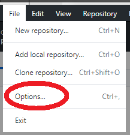
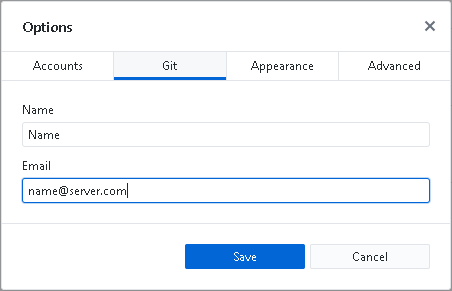
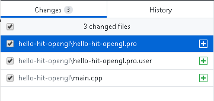
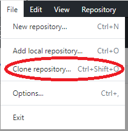

# Git version control system

## Version control system

The *version/revision control system* is a software for tracking changes (usually in source code) and helping programmers to combine changes made by many people at different times (https://en.wikipedia.org/wiki/Version_control).
One of the popular distributed version control systems is Git created by Linus Torvalds for the development of the Linux kernel (https://en.wikipedia.org/wiki/Git).

Additional materials:

* Git website: http://git-scm.com/
* Free book: http://git-scm.com/book
* Tutorial from GitHub: https://guides.github.com/

## GitHub Desktop, GitHub account

Create an account at [GitHub](https://github.com/). Remember that GitHub is a very popular service among the open-source community and choose the alias under which you will be visible on the site carefully. All content published on GitHub, including projects and code, is public by default. GitHub profile can be your business card!

Usually, the version control system is controlled with a `git` program called from the command line. However, there are a number of GUIs that make it easier to work with Git. One of them is GitHub Desktop. Download the program from https://desktop.github.com/ and install it. If this is the first time you run the program, you will be asked to log in with your GitHub account. Otherwise, the program will ask you to log in later.

**Remember to log out of the program after the classes are finished!**

Make sure that GitHub Desktop has the user identity set properly (many people use the program in the lab). Thanks to this, the changes uploaded to the repository will be marked with your username and e-mail address. To do this, select *Options...* from the *File* menu (if the menu is not visible, you can use the *Ctrl*+*,* shortcut):



Then edit the name and email address in the Git tab:



## Creating a repository

GitHub Desktop is used to manage local repositories located on your computer's hard drive. The first step that allows us to work is to create a local repository in our project folder. To do so click:


Then name your repository: *hello-git-name* (don't use "Polish" characters in the name of the repository!) and select the location where your project will be created. Select the Git Ignore configuration. It is worth to choose the language used, e.g. C++ (find out on your own what the .gitignore file is). Create a local repository by clicking *Create Repository*.

View the contents of the folder with the repository created. Note that a hidden *.git* folder has appeared. Think about what it contains.

In the upper left corner there is a drop-down list of repositories:


You can select the current repository you are working with from it. At this point our repository only exists on the local computer. You should place it on the GitHub server. To do this, click on it:


If we have not logged in to GitHub yet, we will be asked to do so.

If you don't want the repository to be public, leave the *Keep this code private* checkbox checked. A free GitHub account allows you to create private repositories shared by up to 3 users. We confirm our willingness to publish the repository and wait for the data to be sent to the server.

Go to your GitHub profile and view the repository you created.

### Initial commit

Let's make sense of our first repository! In the *hello-git-name* project folder created directly, create a sample program design using SFML and OpenGL, as instructed by laboratory 07.

Return to GitHub Desktop. Note that the program has automatically detected changes in the files. A list of modified files and the content of the modifications is displayed. Changes should include 3 files: *main.cpp*, *.pro* and *.pro.user*:



Time to send changes to the GitHub service. In order to do so, in the "Summary" field, put a description of the changes made, every time you make a new change, you should put a short comment on the work done in the code. Make a commit of changes using the button:


At this point, we have informed the local repository of the changes we have made, but they still need to be sent to the server (push). To do so, press the button:


The actions performed above correspond to the execution of commands:

```bash
git commit
git push
```

Return to the GitHub website, open the repository and see if all the files have been uploaded correctly.

### Web-based management, README file

Each repository should contain a *README* file. GitHub.com provides a simple online tool for easy editing. To add a *README* file, log in via your browser and click on it:


Fill in the *README* file with content containing the name of the repository, the author, the tools used, etc. In *README* files it is possible to use simple tags to format text of the [Markdown](https://help.github.com/articles/basic-writing-and-formatting-syntax/) type.

Add the file to the repository by "commiting" it:


Changes made on the remote repository can be immediately downloaded to the local repository. To do this, select the *Fetch* option in GitHub Desktop to download information about the current state of the remote repository:


and then:


The execution of these operations corresponds to the execution of the commands `git fetch` and `git merge`. The *README* file should already be visible in our project folder.

Sending further changes to the remote repository is just as easy. Open the project in the Qt Creator environment and modify the program to draw three cubes. Return to GitHub Desktop and send the changes by adding a new *commit* (and describing the changes) and push the changes (*push*) to the server.

On the GitHub page in the *Commits* tab of your repository you can see the changes made to each commit, restore the previous version and much more. Review them yourself. 

Like other social networking sites, GitHub enables communication between users. Find your friend's profile and start observing it (*follow*). Search for interesting projects and mark them as watched (*watch*/*star*).

## Collaboration on projects

One of the most important features of guitar is the possibility of cooperation of many authors in one project. Return to your new *hello-git-name* repository on GitHub.com and in the *Settings*/*Collaborators* tab add a profile of your colleagues sitting next to you. From now on, the selected user has the option to modify your repository.

Merge into a group of two with the next colleague and add your profiles to each other's repositories.

To start working on changing another user's project, you need to *clone* his project (`git clone`). To do this, return to GitHub Desktop and select *Clone repository* from the menu:



Then find the co-author's repository and click:


Open the cloned project in the development environment and change the direction of rotation of the cubes.

In GitHub Desktop, select the changed local repository and add a new commit and send it to the server.

Download the changes made by your colleague to your repository.

**Remember to log out of GitHub Desktop after your labs are finished!** To do so, select *File* &rarr; *Options...* and then click *Sign Out* in the Accounts tab.

It is also useful to remove local repositories from your computer's hard drive and GitHub Desktop. To do this, select the appropriate repository and select *Remove* from the *Repository* menu.

You can also delete a repository created during the lab to avoid cluttering your GitHub profile (*Settings* &rarr; *Options* &rarr; *Danger Zone* &rarr; *Delete this repository*).

## Assignments

* Read the tutorial to the GitHub: https://guides.github.com/. Read and understand topics up to and including *Be Social*.
* What is the *.git* folder and what does it contain?
* What is the *.gitignore* file and what does it contain? Modify the *.gitignore* file so that changes in the *.pro.user* files are not tracked. Using GitHub.com, remove the previously added *.pro.user* file from the repository.
* Sometimes when working together on a single file, there may be a conflict. Why? In this case, the *merge* operation is executed. Find out what a *merge* is, how to use it and how to deal with it!
* Think about what files might be in the repository? Is it appropriate to upload .exe or .bin files? Is it possible to upload a project packed with .zip to the repository? Why is the answer to the above questions in the negative? Which project/software environment definition files should be included in the repository?

***
Authors: *Michał Fularz*, *Tomasz Mańkowski*, *Jakub Tomczyński*
