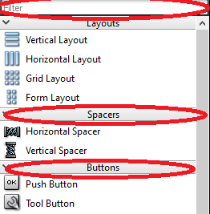
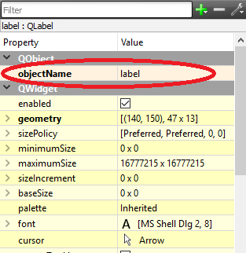
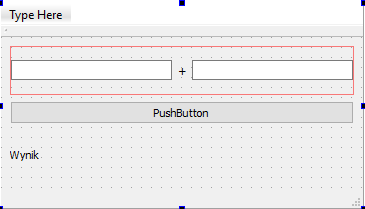

# Qt - introduction to the GUI

## Graphical user interface (GUI)

Graphical User Interface (GUI) is one of many ways for providing information to a computer user and, at the same time, of getting feedback from him/her. Each operating system offers its own GUI manager. Currently, the most popular are:

* Windows:

    * Luna (XP),
    * Aero (Vista, 7, 8, 8.1, 10),
    * Modern UI (8, 8.1, 10).

* Linux:

    * Unity (Ubuntu),
    * KDE,
    * GNOME.

* macOS:

    * Aqua.

Most modern GUIs are based on so-called widgets, otherwise known as controls. A widget is a single GUI element. It can be: a window, a button, a slider, a field for typing a text and so on. A widget does not necessarily have to be a visible element, for example it can be a container placing other widgets inside a window. Nowadays, most of the available widgets have an object-oriented structure. Each input widget receives user-generated events (mouse clicks, keyboard buttons), as well as system-generated events (including the GUI manager). In response, the widget draws its graphic representation on the screen space assigned to it and/or transfers information from the user to the program and vice versa.

## Graphical interface library

In order to use the graphical interface it is necessary to use the graphical interface library, also called the widget library. Each program running under the control of a given operating system (and GUI manager) can use a different set of widgets/controls.

* For Windows systems, Microsoft provides dedicated control libraries in the form of WinForm and WPF, which are a component of the .NET Framework. 
* For macOS systems, the currently valid native library is Cocoa. 
* Solutions derived from Linux systems, thanks to being open-source, are currently gaining popularity, mainly because of their multi-platformity. Many of them have versions for Linux, Windows and OS X, so that once the application is prepared it can be run on all of those platforms. These include GTK+ (developed for GIMP) and Qt (native library for KDE).

## Qt framework

Qt (pronounced cute), besides the widget library also provides a multi-platform programming framework for the C++ language. Qt unifies support for many elements between different platforms, which previously required separate treatment on different systems. This includes support for networks, multimedia, XML and many more. Thanks to the use of Qt the effort put into moving a program written for example under Windows to Linux is minimal. Qt is also compatible with Mac OS X and Android.

Qt is an object-oriented library using C++ language. During the use of Qt it is possible to use all functionalities of C++ language, including the standard library. However, the Qt library implements its own data structures and objects, often with additional, Qt-specific functionality. In order to maintain 100% code compatibility and clarity it is suggested to use those provided by Qt.

Below is a simple console program written using standard library:

```cpp
#include <iostream>
#include <vector>
#include <string>

int main(int argc, char *argv[]) {
    std::cout << "Hello World!" << std::endl;

    std::vector<std::string> sentence;

    for(int i = 0; i < 4; i++) {
        std::string word;
        std::cin >> word;
        sentence.push_back(word);
    }
    return 0;
}
```

and using Qt:

```cpp
#include <QCoreApplication>
#include <QTextStream>
#include <QVector>
#include <QString>

int main(int argc, char *argv[]) {
    QCoreApplication a(argc, argv);

    QTextStream qout(stdout);
    QTextStream qin(stdin);

    qout << "Hello World!" << endl;

    QVector<QString> sentence;

    for(int i =0; i < 4; i++) {
        QString word;
        qin >> word;
        sentence.push_back(word);
    }
    return a.exec();
}
```

## Creating a window application project in Qt

Open Qt Creator, then select *File* → *New File or Project...*. In the *Projects* list, select the category *Application*, then select *Qt Widgets Application*. Confirm your selection with the *Choose...* button.

Name your project and select a location, press *Next*.

The next window allows you to define the name of the class that will be the base of our window application. Usually this base class is the *MainWindow* widget (remember that the window is also a widget), which is the main window of the application. The name of the main window can be changed. It is important that our class inherits from *QMainWindow* (see: *Base class*). Make sure that *Generate form* is checked, so the wizard will automatically create a file describing the appearance of the main window. Press *Next*. In next window option for choosing a language translation appears, this part we can skip by pressing *Next*. Following window allows for choosing a tools kit, this part is similar to one described in [Lab 01 - semester I](http://jug.put.poznan.pl/lab-ie-1/01%20-%20Hello%20World.html). Press *Finish*.

## The skeleton of the window program at Qt

Creating a project from a window application template will add additional files describing the main window to the project: `mainwindow.h` and `mainwindow.cpp` describing the window class from the code side and the file `mainwindow.ui` containing the description of the window layout (appearance).

The starting point for the program is the `main.cpp` file, which contains the `main` function:

```cpp
#include "mainwindow.h"
#include <QApplication>

int main(int argc, char *argv[]) {
    QApplication a(argc, argv); // creates "application" object
    MainWindow w; // creates main window object
    w.show(); // shows main window

    return a.exec(); // starts application event loop
}
```

It can be seen that the above structure is similar to the console example from the introduction. `QApplication a(argc, argv)` creates an object that is the Qt main loop that handles events. An instance of the `MainWindow` object is then created. Finally, `a.exec()`; runs the Qt event loop.

In the Qt library, all objects ultimately inherit from the `QObject` class, no different for the main window class created automatically by Qt Creator. In this case, the inheritance order is as follows: `QObject` → `QWidget` → `QMainWindow` → `MainWindow`. The declaration of the main window class is as follows:

```cpp
#include <QMainWindow>

QT_BEGIN_NAMESPACE
namespace Ui { class MainWindow; }
QT_END_NAMESPACE

class MainWindow : public QMainWindow
{
    Q_OBJECT // macro required for Qt meta-object functionality

public:
    MainWindow(QWidget *parent = nullptr);
    ~MainWindow();

private:
    Ui::MainWindow *ui; // pointer to GUI elements of the window
};
```

It is of course necessary to implement the individual elements of the main window class. Qt Creator did it for us automatically and it looks like this:

```cpp
#include "mainwindow.h"
#include "ui_mainwindow.h"

MainWindow::MainWindow(QWidget *parent)
    : QMainWindow(parent) // calls base class constructor
    , ui(new Ui::MainWindow) // allocates memory for GUI object and calls its constructor
{
    ui->setupUi(this); // initialises GUI
}

MainWindow::~MainWindow()
{
    delete ui; // deletes GUI object
}
```

At this stage, the constructor only configures the GUI, while the destructor, called when the application is closed, removes the GUI information from the memory.

---

#### 🛠🔥 Assignment 🛠🔥

Run the program created from the template.

---

### Using Qt Designer

By double-clicking on any file with the `.ui` extension (in our case `mainwindow.ui`) the editor of the program changes to Qt Designer. This is a mode in which we can use drag and drop to prepare a GUI appearance.

On the left side there is a vertical bar containing a list of standard Qt widgets. Widgets are grouped depending on the basic functionality. At the top there is also a Filter bar that allows you to search the list:



---

#### 🛠🔥 Assignment 🛠🔥

* Familiarize yourself with the list of widgets. Are all their names, including drawings, clear enough to explain how they work? If necessary, use Google search engine.

* Use the drag and drop method to place one `QPushButton`, one `QLabel` and two `QLineEdit` windows on the project. Try to change their location and size.

* Start the program and observe the behavior of the widgets placed in the window.

---

On the right side of Qt Designer there is a *Property Editor*, which is a set of fields allowing you to edit the properties of individual widgets. The information about the focused widget is displayed. Please note that the window itself is also a widget and has its own properties that can be edited in *Property Editor*. Each type of widget will have its own unique set of properties. 

Each widget must have a unique name within the window. The name is given by editing the *objectName* property:



---

#### 🛠🔥 Assignment 🛠🔥

Change the *objectName* for each widget in the window (e.g.: `QPushButton`: *addButton*; `QLineEdit`: *inputValue1*, *inputValue2*; `QLabel`: *result*).

---

Widgets also have a number of other functionalities, mainly concerning their appearance:

* Change the content displayed in `QPushButton`.
* Change the title displayed on the `MainWindow` bar.
* Change the font displayed by the `QLabel`.
* Familiarize yourself with the enable property.
* Review the other properties of each widget.

### Layout

Widgets placed in the window are in no way related to the size of the window. Always, regardless of the size of the window, they will be anchored in a predefined position and will have a fixed size:

---

#### 🛠🔥 Assignment 🛠🔥

Run the program and try to resize the window. Are the widgets always visible?

---

Qt has a system for automatically adjusting the position and size of widgets depending on the current appearance of the window they are in, called *Layout*. *Layout* is a widget in which you can place other GUI elements.

The basic method of placing elements on a window using *Layout* is a mechanism built into each window.

---

#### 🛠🔥 Assignment 🛠🔥

* Right-click on the window and from the context menu select *Lay Out* and then *Lay Out in a Grid*. Elements should be automatically placed in the window. Start the program and check the widgets' behavior during window resizing.

* It is possible to reorganize the window elements by drag-and-drop. Try to change the placement of the layout widgets. Run the program for different configurations and check the behavior.

It is possible to nest one layout inside another:

* Select Horizontal Layout from the widget library and place it on the window.

* Try to place the elements on the window so that the following effect can be achieved:



* Test how the program works.

---

Sometimes it is necessary to set a minimum and maximum size for each widget. Therefore you can find the properties of *minimumSize* and *maximumSize* for each widget.

An important widget, which builds the layout of the window, is *Spacer*, i.e. filler. They do not play any role other than adjusting the appearance of the window.

---

#### 🛠🔥 Assignment 🛠🔥

* Test the behavior of the program when changing the *minimumSize* and *maximumSize* of individual widgets.

* Try using *Horizontal Spacer* and *Vertical Spacer* (they also have minimum and maximum dimensions).

* Use the *Horizontal Layout* and *Horizontal Spacer* to move the result (`QLabel`) to the right edge of the window:


---

## Signals and Slots

Qt implements a mechanism of signals and slots. It is a tool for managing asynchronous events originating both from the program and from the user or operating system. The use of *signals* and *slots* is very simple. Every class inheriting from the *QObject* in Qt can implement signals, i.e. functions that emit an event, while at the same time every class can implement slots, i.e. functions that capture and process these signals. For example, a `QPushButton` class has a `clicked()` signal that is emitted when user presses a button. 

It is possible to automatically create connections between the GUI elements and the main window class from the Qt Designer level. Qt Creator automatically creates a slot and a connection between the widget signal and this slot:

---

#### 🛠🔥 Assignment 🛠🔥

Use the right mouse button to select the *addButton* widget (`QPushButton`) and from the context menu select *Go to Slot...*, then select the signal `clicked()` and confirm with OK.

---

Qt Creator moves the user to the editing mode, to the position of the `MainWindow` class, where the method called when the button is clicked was created:

```cpp
void MainWindow::on_addButton_clicked()
{

}
```

At the same time Qt Creator automatically creates a slot declaration in the class `MainWindow` (in the `mainwindow.h` file):

```cpp
class MainWindow : public QMainWindow {
    /* ... */
private slots:
    void on_pushButton_clicked();
    /* ... */
};
```

---

#### 🛠🔥 Assignment 🛠🔥

Set breakpoint inside the slot handling method (`void MainWindow::on_AddButton_clicked()`), run the program in Debug mode. Verify the proper operation of the slot.

---

## Access to GUI elements

All GUI elements become fields in the `ui` object, so the access to them is always as follows: `ui->objectName`, where `objectName` is the widget name given in the Property Editor.

As in any object-oriented library, all GUI objects have methods to modify their behavior and appearance. For example, in order to change the text displayed by the `QLabel` it is necessary to execute:

```cpp
ui->objectName->setText("Hello! This is my first Qt application");
```

---

#### 🛠🔥 Assignment 🛠🔥

* Place the above line in the method handling the button click.

* Run the program and check its correctness. The content of the `QLabel` should be changed after clicking a button.

---

Reading the value from `QLineEdit` is done as follows:

```cpp
QString text = ui->objectName->text();
```

---

#### 🛠🔥 Assignment 🛠🔥

* Modify the program so that every time you press a button, it will cause the content of one of the `QLineEdit` to be written into the `QLabel`.

* Next, modify the program so that the value entered in the `QLineEdit` fields is added and displayed in the `QLabel` after pressing the button.

To convert the `QString` into an integer, use the `QString::toInt( )` method:

```cpp
QString text = ui->objectName->text();
int value = text.toInt();
```

To convert from a number to `QString`, use the static method `QString::number(value)`:

```cpp
int value = 15;
QString text = QString::number(value);
```

---

Information about which methods a given widget or object of a given class offers is easiest to obtain from the Qt documentation page, e.g.: [http://doc.qt.io/qt-5/qlabel.html](http://doc.qt.io/qt-5/qlabel.html). 

## Final assignments 🔥🛠

#### 1. Calculator

The task is to create a simple graphical calculator. The calculator should have

* 2 active QLineEdit fields, in which the user will be able to enter values for which the action will be performed. 
* Inactive (enabled = false) `QLineEdit` field, to which the result will be sent.
* "Calculate" button.
* Four `QRadioButton`, representing which activity is used (addition, subtraction, multiplication, division). `QRadioButton` can be grouped using the `QGroupBox`.
* CE button that deletes both the contents of the input and output fields.
* Two `QLabel` on which the result is displayed in binary and hexadecimal notation.

<!--Jeden przycisk QPushButton przepisujący wartość z pola wyniku do pierwszego pola wejściowego. Na przycisku zamiast opisu umieść grafikę strzałki symbolizującą opisaną operację. Wykorzystaj QPushButton::SetIcon( );  (poszukaj w Internecie jak wykonać).-->

#### 2. Advanced calculator

Create a calculator similar to the one available in Windows. The window should have a field where you can enter the value manually using the keyboard, or using the 0 to 9 buttons below. To format the `QLineEdit` input value, use its `inputMask` property.  Each press of the numeric button adds the appropriate value at the end of the input window. Try using `QButtonGroup`.  Create a second group of buttons responsible for selecting the type of action and displaying the result.

#### 3. Database editor

Create a program that is an interface to the student database. The user should be able to add a new entry using the fields: Name, Surname, E-mail, Index No., Man/Woman (QRadioButton), Field of study (drop-down list - QComboBox), Graduated (QCheckBox), Note (QPlainTextEdit). Create a student class containing the above information and add new entries to QVector. The list of available entries should be displayed in the QListView. Add the ability of previewing and deleting the selected entry.

---
Authors: *Tomasz Mańkowski*, *Jakub Tomczyński*
