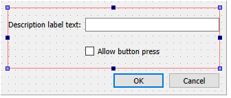
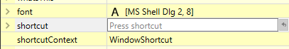
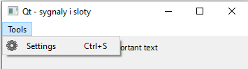

# Qt - signals and slots

## Signals and slots

### The basics

Qt implements a mechanism of signals and slots. It is a tool that allows you to manage asynchronous events (occurring in random moments without blocking the execution of the code that waits for them) from the program, the user or the operating system. The use of signals and slots is very simple. Every class in Qt can implement signals, i.e. functions emitting an event. At the same time each class can implement slots, i.e. functions that capture and process the above signals. For example, a `QPushButton` class has a `clicked()` signal that is emitted when the user presses a button.

In order to handle the event from the button, in the main window class we need to prepare a suitable slot. For this purpose, in the class declaration we put the directive `slots:` with access modifier (in this case `private`), and immediately below it the declaration of the function that will handle the event:

```cpp
class MainWindow : public QMainWindow {

...

private slots:
    void my_button_slot();
};
```

Then in the `.cpp` file we define our event handling function. For now, it will remain empty:

```cpp
void MainWindow::my_button_slot()
{

}
```

---

#### 🛠🔥 Assignment 🛠🔥

- Create a new *Qt Widgets Application*.
- Using a Qt Designer populate the windows with widget of types:  `QPushButton` and `QLabel`, for compatibility with further class course do not change the `objectName` of widgets. Exemplary window layout:


- Edit files `mainwindow.cpp` and `mainwindow.h` and prepare a slot for handling the button as instructed above.

---

**Note:** During the previous classes you could notice that Qt Creator can generate the code described above for the controls placed on the form - usually it is worth to use this function, but for the demonstration of the slots mechanism we deliberately omit it.

### Connecting signals to slots

Signals and slots should be connected together using a dedicated `connect(...)` function. It connects two objects: the sender (signal) and the receiver (slot). The `connect` must be called only once. This call can be placed e.g. in a class constructor. In order to connect a button pressed event with our prepared slot, it is necessary to make a call, e.g. in `MainWindow` class constructor:

```cpp
MainWindow::MainWindow(QWidget *parent): QMainWindow(parent), ui(new Ui::MainWindow)
{
    ui->setupUi(this);

    connect(ui->pushButton, &QPushButton::clicked, this, &MainWindow::my_button_slot);
}
```

The `connect` function takes the following arguments in this case:

* a pointer to the object sending the signal,
* a pointer to the prototype of the function that constitutes the signal,
* a pointer to the object receiving the signal,
* a pointer to the prototype of a function that is a slot.

**Note:** if we put a button called `pushButton` (default name) on the form and add a slot called `on_pushButton_clicked` to the class of the window containing the button, Qt will implicitly (without using the `connect` function in the code) connect the `clicked` signal to this slot. To avoid this behavior (only for demonstrations), the slot is called `my_button_slot` in the above examples.

---

#### 🛠🔥 Assignment 🛠🔥

- In `MainWindow` constructor add a call of `connect` which will connect the button with previously prepared slot.
- In the slot place a code which will change the content of the `QLabel` to *NEW TEXT AFTER CLICK*, after pressing the button.

---

### Additional information

One signal can trigger multiple slots and vice-versa - one slot can be triggered by multiple signals from different objects.

More about signals and slots can be found in the description on the [Qt project subpage](https://doc.qt.io/qt-5/signalsandslots.html).

## Modal dialog windows and communication using slots

Modal dialog boxes are windows that, when displayed, block access to the main window until they are closed. They can be used to set the configuration parameters of the program. These windows, usually inherit from the `QDialog` class and contain the Ok and Cancel buttons.

Each window has to be created as an separate class. The simplest way to do that is using a Qt Creator build-in wizard. To do that click *File*  → *New File or Project…*. On the *Files and Classes* list choose *Qt*, and next *Qt Designer Form Class*. Confirm using *Choose…*:


In next window choose *Dialog with Buttons Bottom* and click *Next*. This is followed by naming procedure of our freshly created classes. Edit the *Class name* field with will cause all the remaining fields to be filled accordingly. Confirm by clicking *Next* and *Finish*. The project tree will be added with `.ui`, `.cpp` and `.h` files.

---

#### 🛠🔥 Assignment 🛠🔥

- With program's main window:
    - add `QPushButton` with text *SETTINGS*, change `objectName` to `settingsButton`,
    - add `QLabel` and fill with some text, change `objectName` to `descriptionLabel`.

    

- Using a wizard add to the project a dialog window class and name it `SettingsDialog`:
    - place all elements in the dialog inside the *Form Leyout*,
    - add `QLineEdit`, change `objectName` to `descriptionTextEdit`,
    - add `QCheckBox`, change `objectName` to `buttonEnabledCheckBox`.

    

- Into the main window's class add a private slot: `void open_settings()`, next using a `connect` mechanism connect the `settingsButton` with `open_settings()` triggering.

---

For the dialog creation to be possible it is needed to include its class within the  `mainwindow.cpp`, depending on the dialog window class name, e.g.:

```cpp
#include "settingsdialog.h"
```

Opening of the modal window, blocking the parent window interface, can be done in following manner:

```cpp
void MainWindow::open_settings()
{
    SettingsDialog dialog; // creation of the dialog window object

    dialog.exec(); // execution/showing of the window; mainwindow will hold until closing the dialog
}
```

---

#### 🛠🔥 Assignment 🛠🔥

- Add to your program the possibility to pen the dialog window.
- Test your program.

---

Next step needed for making the settings window work is passing the current settings values into it, in order to present them to the user. There are few possible ways to to that. For example the `SettingsDialog` class can implement a public method for passing and setting the values. Another option is using the `SettingsDialog` constructor.

---

#### 🛠🔥 Assignment 🛠🔥

- Choose your method for passing the values into the dialog window (public method or modification of the default constructor of the `SettingsDialog`).
- In order to read the current state of the button use:

```cpp
ui->pushButton->isEnabled() // bool type
```

- For reading the current `QLabel` text use:

```cpp
ui->descriptionLabel->text() // QString type
```

- In `SettingsDialog` public method or constructor use the passed values and change the appearance of `QLineEdit` and `QCheckBox` so they reflect the state of the main widow widgets, e.g.:

```cpp
ui->buttonEnabledCheckBox->setChecked(button_enabled);
ui->descriptionTextEdit->setText(description_text);
```

---

One of the options to catch the window closing event is to use the implicitly placed *OK* and *Cancel* buttons. If the dialog was created using a wizard with *Dialog with Buttons Bottom*, this caused the Qt Designer to automatically add an `QDialogButtonBox` widget with `objectName` of `buttonBox`. `QDialogButtonBox` object emits and `QDialogButtonBox::accepted()` signal when user clicks *OK*.

---

#### 🛠🔥 Assignment 🛠🔥

- In `SettingsDialog` add private slot `void  buttonBoxClicked()` which will be used to handle the *OK* click event.
- In `SettingsDialog` constructor make a connection between `accepted` signal and newly created slot:

```cpp
connect(ui->buttonBox, &QDialogButtonBox::accepted, this, &SettingsDialog::buttonBoxClicked);
```

---

At this point, after hitting *OK* the dialog window will be closed, but modification of the elements in the settings dialog will not influence anything on the main window, the settings has not been yet passed to `MainWindow`. One option to pass the information between classes (`SettingsDialog` to `MainWindow` in this case) is also using signals/slots. `SettingsDialog` should emit a signal that includes all the parameters of the object in the form, which than have to be captured. In Qt all the object inheriting `QObject` can emit a signal using a `emit` keyword. In order to do that we have to add a `signals:` directive into the class declaration, a below it a declaration of the signal together with the parameters to be passed, e.g.:

```cpp
class SettingsDialog : public QDialog
{
    /****/

signals:
    void changesAccepted(bool button_enabled, QString description_text);

    /****/
};
```

---

#### 🛠🔥 Assignment 🛠🔥

- To `SettingsDialog` class add signal:

```cpp
void changesAccepted(bool button_enabled, QString description_text);
```

- Inside `SettingsDialog::buttonBoxClicked()` method (triggered when pressing *OK*) place a `changesAccepted` signal emission with proper parameters:

```cpp
void SettingsDialog::buttonBoxClicked()
{
    emit changesAccepted(ui->buttonEnabledCheckBox->isChecked(), ui->descriptionTextEdit->text());
}
```

---

The last step is to capture the signal in the main window, in order to to that in `MainWindow` class a private slot is needed, which will be connected to the signal emitted by `SettingsDialog`, and then properly served. It is crucial for the slot to have the same parameter list as the corresponding signal. The order and types of the arguments are important, name is unrestricted.

---

#### 🛠🔥 Assignment 🛠🔥

- In `MainWindow` class add the declaration and implementation of the private slot with proper parameter list. In the implementation handle the changes of interface based on passed arguments:

```cpp
//mainwindow.h
private slots:
    void changeValues(bool button_enabled, QString description_text);
```

```cpp
//mainwindow.cpp
void MainWindow::changeValues(bool button_enabled, QString description_text)
{
    ui->pushButton->setEnabled(button_enabled);
    ui->descriptionLabel->setText(description_text);
}
```

- In `MainWindow::open_settings()` slot after the creation of the dialog window object, and before its execution, add `connect` that will connect signal from the `SettingsDialog` to the newly created slot in `MainWindow`:

```cpp
void MainWindow::open_settings()
{
    SettingsDialog dialog(ui->pushButton->isEnabled(), ui->descriptionLabel->text());

    connect(&dialog, &SettingsDialog::changesAccepted, this, &MainWindow::changeValues);

    dialog.exec();
}
```

- Test the settings mechanism.

---

## QMenu and QAction

For classes inheriting from `QMainWindow` (usually describing the main window of the program), a user menu (`QMenu`) and a toolbar are assigned by default. The menu structure and toolbar can be created from Qt Designer: 


---

#### 🛠🔥 Assignment 🛠🔥

- Add *Tools* menu with *Settings* entry to your program.

---

Adding entries do the `QMenu` will automatically cause a creation of `QAction` object with generated names based on the text entered:


In an easy way we can assign an icon to the `QAction`. For doing that we have to highlight the `QAction` object we want to edit and than modify the *icon* field be choosing *Choose File...*. You have to remember that when using an external file it will not be included into the binary `.exe`, thus the file has to be placed in the execution folder of the program. In case of Qt Creator the programs are executed in the corresponding **build** folder for the project.


Easy way to define a keyboard shortcut exist. Pressing a keyboard shortcut will cause the same action as clicking the menu entry. For defining edit the *shortcut* field:



Clicking the menu entry (and using a keyboard shortcut) will emit a `QAction::triggered` signal, which can be connected with a slot using a `connect`.

---

#### 🛠🔥 Assignment 🛠🔥

- For `acctionSettings` object:
    - add icon: [settings.png](./_resources/11/settings.png) (remmember to place it in the build folder of the program),
    - add *Ctrl + S* keyboard shortcut.

    

- In `MainWindow` constructor add a connection between `QAction::triggered` from `acctionSettings`and `MainWindow::open_settings` slot.
- Test the various setting dialog's opening methods.

---

## Final assignments 🛠🔥

#### Text editor

Use Qt to write a simple text editor.

The editor should allow you to:

* create a new document,
* open a file,
* overwrite the file,
* save the file as a new one.

Add appropriate widgets to the window and actions to the *File* menu.

Use the [QFileDialog](https://doc.qt.io/qt-5/qfiledialog.html) class to select files.

Load the entire contents of the open file into the text window (the [QFile](https://doc.qt.io/qt-5/qfile.html) class is used for file operations).

Allow to overwrite the file (save under the same path) or save it as a new file.

Add *Find and replace* to the program. Create a window class (*File* → *New File or Project* → *Qt* → *Qt Designer Form Class* → *Widget*) where you can enter two strings of characters (source and target) and two buttons: *Replace* and *Replace all*.

Add the *Edit* menu with the *Find and replace* action.

Connect their signals to the slots in the main window and implement the required functionality.

You can find some implementation details in the [Application Example](https://doc.qt.io/qt-5/qtwidgets-mainwindows-application-example.html).

---
Authors: *Tomasz Mańkowski*, *Jakub Tomczyński*, *Dominik Pieczyński*