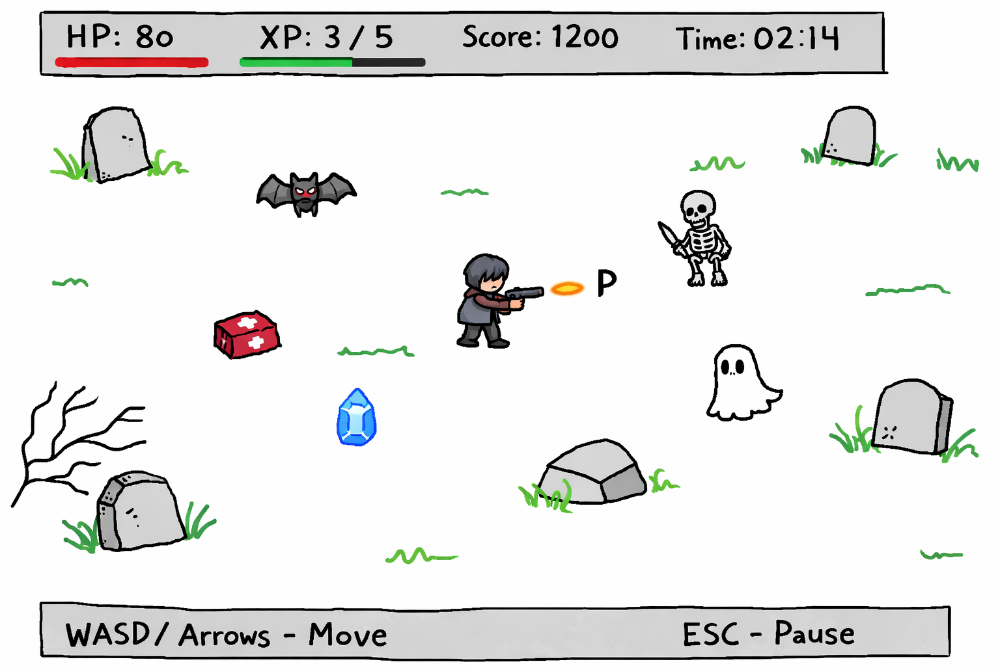
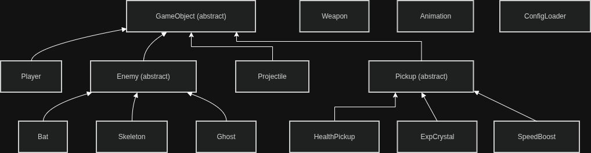
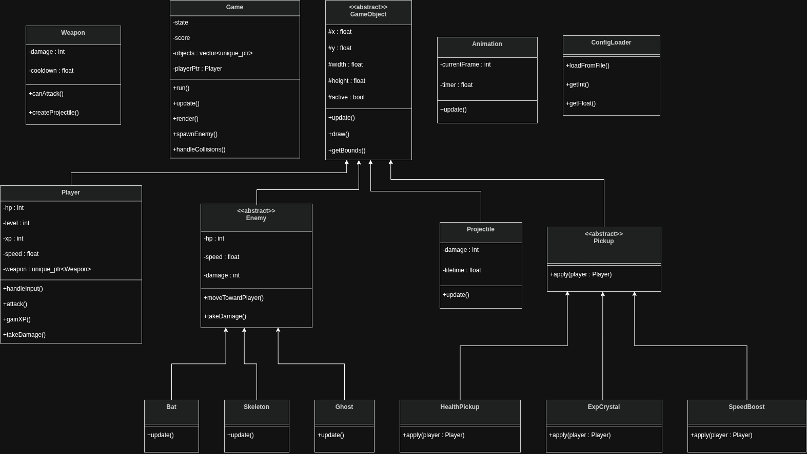

# Example concept: Vampire Survivors clone

## Short description

The project is a simple 2D survival game inspired by Vampire Survivors.
The player controls a character moving around one arena and surviving as long as possible against waves of enemies. Enemies appear randomly and move toward the player. The character attacks automatically. The player collects experience and bonuses, improves stats, and tries to survive as long as possible.

## Main elements

- **Character**: one player-controlled vampire hunter
- **Enemies**: bats, skeletons, ghosts
- **Bonuses**: health pack, temporary invincibility, temporary speed boost, temporary attack boost
- **Gameplay**: survive, avoid enemies, collect bonuses, gain points
- **Controls**: WASD / arrows to move, Esc to pause

## Functionalities

- Character movement and animation
- Enemy spawning and movement
- Automatic attacks and damage calculation
- Bonus spawning and collection
- HP system for character and enemies
- Score tracking and display
- Experience points and leveling system (each level increases character damage and HP)
- Game over condition and restart option
- Simple UI for score and health display
- Sound effects for attacks, enemy hits, and bonus collection
- Basic menu for starting and pausing the game

## Dummy screen

## Classes diagram
Below there are two class diagrams. The first one is a simple version with only the main classes and their relationships. The second one is more detailed, showing the main attributes and methods of each class. **Only the first one (simple) is mandatory in the project concept**, the second one is optional, but it is recommended to create it as it helps to clarify the design and implementation of the project.

Both diagrams are not final and can be modified during the implementation phase. They are meant to provide a general overview of the structure of the project and the main components involved. The actual implementation may require additional classes, attributes, or methods that are not shown in these diagrams.

### Simple class diagram

### Detailed class diagram

