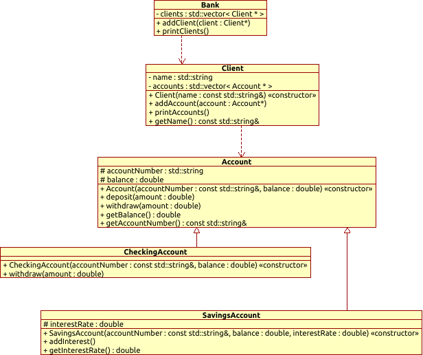

# Sample questions

## Classes and inheritance

### Question 1:

The below diagram illustrates the relation between the classes and their methods and fields, the architecture of the program is often presented by such a diagram. 



based on the given diagram write a program that presents a banking system. Create instances of the classes in main as convenient and call its public methods with appropriate parameters.

`CheckingAccount` should charge a 1.50 transaction fee for each withdrawal.

**Template:**
```cpp
#include <iostream>
#include <string>
#include <vector>

int main(){
    // Create accounts using std::make_unique
    std::unique_ptr<Account> account1 = // TODO: complete using make_unique
    std::unique_ptr<SavingsAccount> account2 = // TODO: complete using make_unique
    std::unique_ptr<CheckingAccount> account3 = // TODO: complete using make_unique

    // ... Deposit and withdraw operations ...
    // TODO: for account1 use deposit and withdraw
    // TODO: for account2 use deposit and addInterest
    // TODO: for account3 use withdraw

    // Create clients and add accounts using std::move
    std::unique_ptr<Client> client1 = // TODO: complete using make_unique

    // TODO: for client1 add account1 and account2

    std::unique_ptr<Client> client2 = // TODO: complete using make_unique

    // TODO: for client2 add account3

    // Create bank and add clients using std::move
    Bank bank;
    // TODO: for bank add client1 and client2

    // Print bank clients and their accounts
    bank.printClients();

    return 0;
}

```

### Answer 1:

```cpp
#include <iostream>
#include <string>
#include <vector>
#include <memory>

class Account {
protected:
    std::string accountNumber;
    double balance;

public:
    Account(const std::string& accountNumber, double balance)
        : accountNumber(accountNumber), balance(balance) {}

    void deposit(double amount) {
        balance += amount;
        std::cout << "Deposit successful. New balance: " << balance << std::endl;
    }

    void withdraw(double amount) {
        if (balance >= amount) {
            balance -= amount;
            std::cout << "Withdrawal successful. New balance: " << balance << std::endl;
        }
        else {
            std::cout << "Insufficient funds. Balance: " << balance << std::endl;
        }
    }

    double getBalance() const {
        return balance;
    }

    const std::string& getAccountNumber() const {
        return accountNumber;
    }
};

class CheckingAccount : public Account {
public:
    CheckingAccount(const std::string& accountNumber, double balance)
        : Account(accountNumber, balance) {}

    void withdraw(double amount) {
        // Charge a $1.50 transaction fee for each withdrawal
        double totalAmount = amount + 1.5;
        
        if (balance >= totalAmount) {
            balance -= totalAmount;
            std::cout << "Withdrawal successful. New balance: " << balance << std::endl;
        }
        else {
            std::cout << "Insufficient funds. Balance: " << balance << std::endl;
        }
    }
};

class SavingsAccount : public Account {
protected:
    double interestRate;

public:
    SavingsAccount(const std::string& accountNumber, double balance, double interestRate)
        : Account(accountNumber, balance), interestRate(interestRate) {}

    void addInterest() {
        double interest = balance * interestRate / 100;
        balance += interest;
        std::cout << "Interest added. New balance: " << balance << std::endl;
    }

    double getInterestRate() const {
        return interestRate;
    }
};

class Client {
private:
    std::string name;
    std::vector<std::unique_ptr<Account>> accounts;

public:
    Client(const std::string& name)
        : name(name) {}

    void addAccount(std::unique_ptr<Account> account) {
        accounts.push_back(std::move(account));
    }

    void printAccounts() const {
        std::cout << "Accounts for " << name << ":\n";
        for (const auto& account : accounts) {
            std::cout << account->getAccountNumber() << " - $" << account->getBalance() << "\n";
        }
    }

    const std::string& getName() const {
        return name;
    }
};

class Bank {
private:
    std::vector<std::unique_ptr<Client>> clients;

public:
    void addClient(std::unique_ptr<Client> client) {
        clients.push_back(std::move(client));
    }

    void printClients() const {
        std::cout << "Clients:\n";
        for (const auto& client : clients) {
            std::cout << client->getName() << "\n";
            client->printAccounts();
            std::cout << "\n";
        }
    }
};

int main() {
    // Create accounts using std::make_unique
    std::unique_ptr<Account> account1 = std::make_unique<Account>("A10001", 5000);
    std::unique_ptr<SavingsAccount> account2 = std::make_unique<SavingsAccount>("S10001", 10000, 2.5);
    std::unique_ptr<CheckingAccount> account3 = std::make_unique<CheckingAccount>("C10001", 2000);

    // ... Deposit and withdraw operations ...
    account1->deposit(1000);
    account1->withdraw(2000);
    account2->deposit(500);
    account2->addInterest();
    account3->withdraw(500);

    // Create clients and add accounts using std::move
    std::unique_ptr<Client> client1 = std::make_unique<Client>("John Doe");
    client1->addAccount(std::move(account1));
    client1->addAccount(std::move(account2));

    std::unique_ptr<Client> client2 = std::make_unique<Client>("Jane Smith");
    client2->addAccount(std::move(account3));

    // Create bank and add clients using std::move
    Bank bank;
    bank.addClient(std::move(client1));
    bank.addClient(std::move(client2));

    // Print bank clients and their accounts
    bank.printClients();

    return 0;
}
```

### Question 2:
Create methods for `Stack` class that allows for the calls in the `main` function. It is supposed to keep stacked intigers.

**Template:**
```c++
#include <iostream>
#include <vector>

class Stack {
public:
    Stack(std::vector<int> numbers) 
    {
        \\ TODO
    }
    \\ TODO
private:
    std::vector<int> _numbers;
};

int main()
{
    Stack stack1({3, 4, 3, 5, 4, 9});
    Stack stack2({3, 4, 7, 11});

    std::cout << "Stack 1: " << stack1 << std::endl;
    std::cout << "Stack 2: " << stack2 << std::endl;

    Stack concatenate = stack1 + stack2; //merge the stacks together: {3, 3, 4} + {1, 2, 3} gives {3, 3, 4, 1, 2, 3}
    std::cout << concatenate << std::endl;

    stack1--; //remove the top element from stack: {3, 3, 4}-- gives {3, 3}
    std::cout << "Top removed: " << stack1 << std::endl;

    stack1 << 15 << 8; // add new element on top of the stack
    std::cout << "New added: " << stack1 << std::endl;
    
    return 0;
}
```

***
Authors: *Kamil Młodzikowski*, *Iman Esfandiyar*