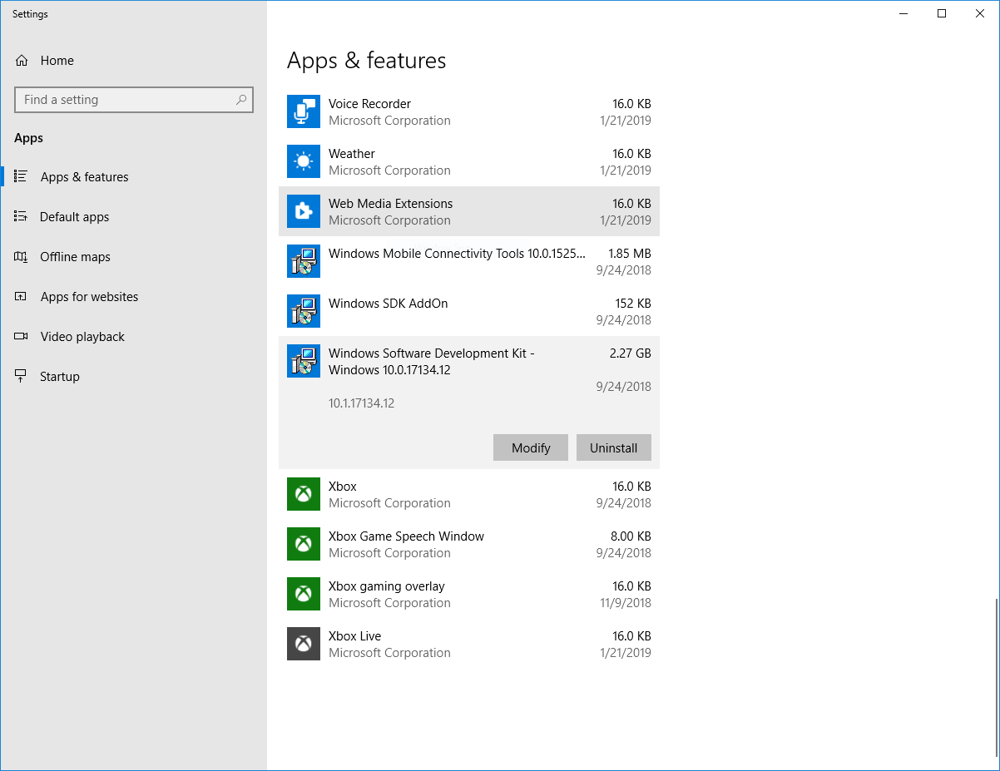
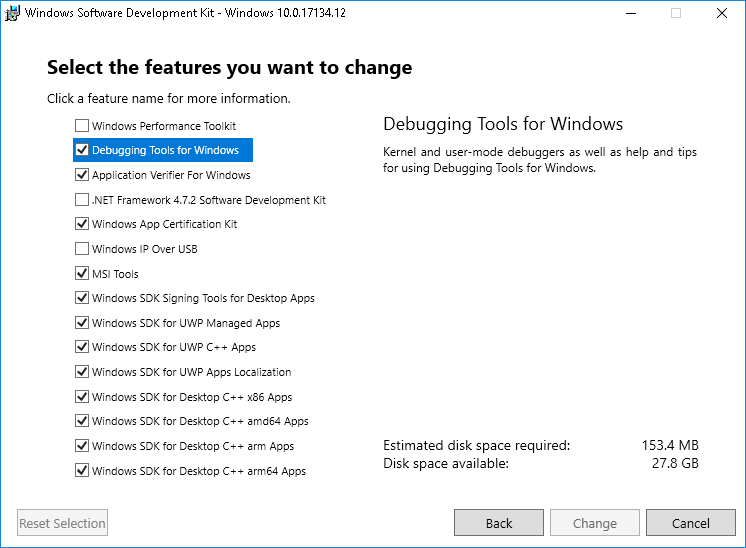
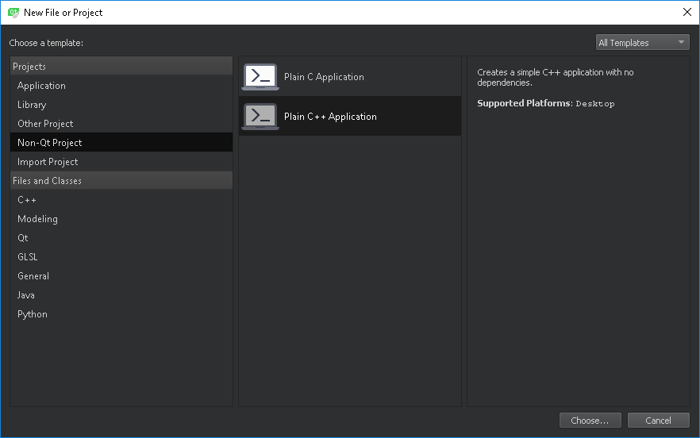
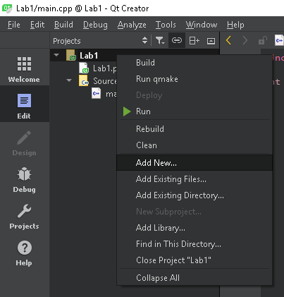
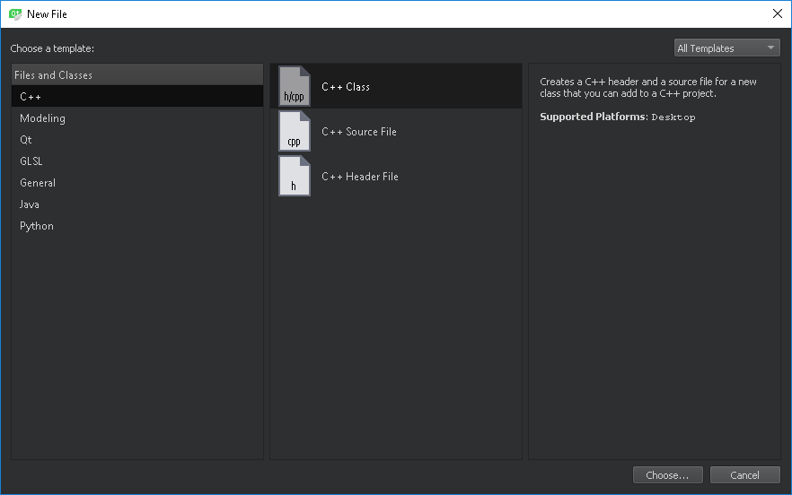

# Installing Qt Creator environment

## If you do not have Microsoft Visual Studio installed

### Installation of Build Tools for Visual Studio

Qt Creator does not have the compiler built-in by default, but allows you to use external compilers.

The Qt Creator installer allows you to automatically install the *MinGW* compiler kit (*GCC* version for Windows), but for full compatibility, we will use the Microsoft compiler from Build Tools for Visual Studio.

If you already have Microsoft Visual Studio installed, Qt Creator will use the compiler installed with it. If not, download the package installer from https://visualstudio.microsoft.com/thank-you-downloading-visual-studio/?sku=BuildTools&rel=15 and run. Select the *Visual C++ build tools* package for installation and confirm the installation.

## Installing debugger tools

In order to use the debugger in an environment other than Visual Studio, install the appropriate Windows SDK component.

The first step is to run the Apps & features settings. Then select the *Modify* option for the *Windows Software Development Kit*:

When in the wizard, select: *Change*, and then add the selection to the *Debugging Tools for Windows* component:

After clicking the *Change* button the component will be installed.

## Installing QtCreator

The QtCreator environment and Qt libraries can be downloaded from http://download.qt.io/official_releases/online_installers/qt-unified-windows-x86-online.exe .

A *Qt Account* is not required to work with the environment - choose **Skip** at the login question stage.

During the installation, at the stage of components selection (Select Components), the following additional selection should be made:
* Qt &rarr; Qt 5.12.1 &rarr; MSVC 2017 64-bit

## Creating a new project

To create a new project in the QtCreator environment, select *New File or Project...* from the *File* menu. This will open a window where you can select Non-Qt Project &rarr; Plain C++ Application:

In the next step you should give the project a name of your choice **not using Polish characters**. Subsequent configuration steps should be completed while maintaining the default settings.

### Adding files to the project

You can add new header and source files to a QtCreator project by right-clicking on the project name and selecting *Add new*:

This displays the following window, which, after selecting the file type and going further, allows you to give it a name:

