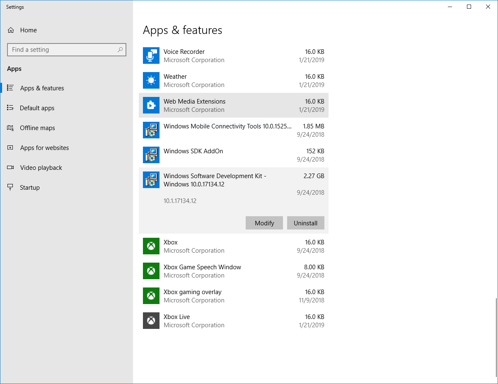
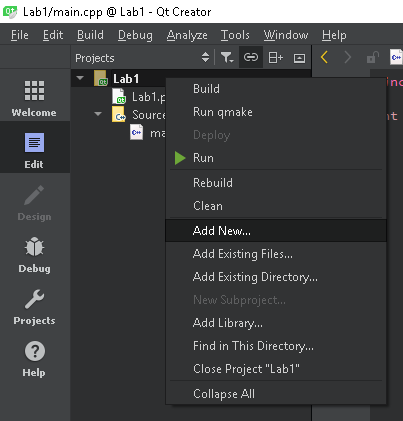

# Instalacja środowiska Qt Creator

## Jeśli nie masz zainstalowanego Microsoft Visual Studio

### Instalacja Build Tools for Visual Studio

Qt Creator nie jest domyślnie dostarczany z kompilatorem, pozwala natomiast wykorzystywać zewnętrzne kompilatory.

Instalator Qt Creatora pozwala na automatyczną instalację zestawu kompilatorów *MinGW* (*GCC* w wersji dla systemu Windows), ale w celu zachowania pełnej zgodności, wykorzystamy kompilator od Microsoftu z pakietu Build Tools for Visual Studio.

Jeśli masz już zainstalowany Microsoft Visual Studio, Qt Creator wykorzysta zainstalowany wraz z nim kompilator. Jeśli nie, pobierz instalator pakietu spod adresu https://visualstudio.microsoft.com/thank-you-downloading-visual-studio/?sku=BuildTools&rel=15 i uruchom. Zaznacz do instalacji pakiet *Visual C++ build tools* i zatwierdź instalację.

## Instalacja narzędzi debuggera SDK

W celu wykorzystania debuggera w środowisku innym niż Visual Studio, należy zainstalować doinstalować odpowiedni komponent Windows SDK.

Pierwszym krokiem jest uruchomienie ustawień Apps & features (Aplikacje i funkcje). Następnie należy wybrać opcję *Modify* dla *Windows Software Development Kit*:

W uruchomionym kreatorze należy wybrać kolejno: opcję *Change*, a następnie dodać zaznaczenie komponentu *Debugging Tools for Windows*:

Po kliknięciu przycisku *Change* komponent zostanie zainstalowany.

## Instalacja QtCreator

Środowisko QtCreator wraz z bibliotekami Qt można pobrać spod adresu http://download.qt.io/official_releases/online_installers/qt-unified-windows-x86-online.exe .

Konto *Qt Account* nie jest wymagane do pracy ze środowiskiem - na etapie pytania o login należy wybrać **Skip**.

Podczas instalacji na etapie wyboru komponentów (Select Components) należy dokonać następującego, dodatkowego wyboru:
* Qt &rarr; Qt 5.12.1 &rarr; MSVC 2017 64-bit

## Utworzenie nowego projektu

W celu utworzenia nowego projektu w środowisku QtCreator należy z menu *File* wybrać opcję *New File or Project...*. Spowoduje to uruchomienie okienka, w którym należy wybrać opcję Non-Qt Project &rarr; Plain C++ Application:

W kolejnym kroku projektowi należy nadać wybraną przez siebie nazwę **nie stosując polskich znaków**. Kolejne etapy konfiguracji należy przejść zachowując ustawienia domyślne.

### Dodawanie plików do projektu

Do projektu QtCreator można dodawać nowe pliki nagłówkowe i źródłowe klikając prawym przyciskiem myszy na nazwie projektu i wybierając opcję *Add new*:

Powoduje to wyświetlenie następującego okna, które po wybraniu rodzaju pliku i przejściu dalej umożliwia nadanie mu nazwy:

