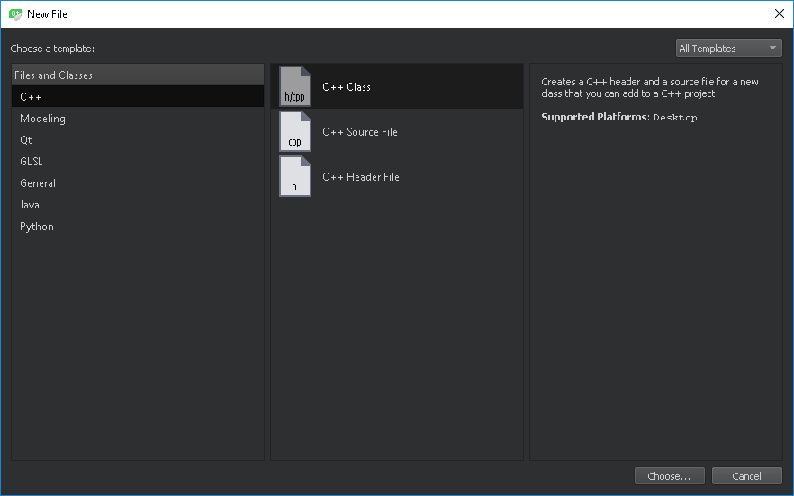

Wstęp do klas
=============

Instalacja Windows SDK
----------------------
W celu wykorzystania debuggera w środowisku innym niż Visual Studio należy zainstalować doinstalować odpowiedni komponent Windows SDK.

Pierwszym krokiem jest uruchomienie ustawień Apps & features (Aplikacje i funkcje). Następnie należy wybrać opcję *Modify* dla *Windows Software Development Kit*:

W uruchomionym kreatorze należy wybrać kolejno: opcję *Change*, a następnie dodać zaznaczenie komponentu *Debugging Tools for Windows*:

Po kliknięciu przycisku *Change* komponent zostanie zainstalowany.

Instalacja QtCreator
--------------------
Środowisko QtCreator wraz z bibliotekami Qt można pobrać [tutaj](http://download.qt.io/official_releases/online_installers/qt-unified-windows-x86-online.exe).

Konto *Qt Account* nie jest wymagane do pracy ze środowiskiem - na etapie pytania o login należy wybrać **Skip**.

Podczas instalacji na etapie wyboru komponentów (Select Components) należy dokonać następującego, dodatkowego wyboru:
* Qt &rarr; Qt 5.12.1 &rarr; MSVC 2017 64-bit

Utworzenie nowego projektu
--------------------------
W celu utworzenia nowego projektu w środowisku QtCreator należy z menu *File* wybrać opcję *New File or Project...*. Spowoduje to uruchomienie okienka, w którym należy wybrać opcję Non-Qt Project &rarr; Plain C++ Application:

W kolejnym kroku projektowi należy nadać wybraną przez siebie nazwę **nie stosując polskich znaków**. Kolejne etapy konfiguracji należy przejść zachowując ustawienia domyślne.

Dodawanie plików do projektu
----------------------------
Do projektu QtCreator można dodawać nowe pliki nagłówkowe i źródłowe klikając prawym przyciskiem myszy na nazwie projektu i wybierając opcję *Add new*:

Powoduje to wyświetlenie następującego okna, które po wybraniu rodzaju pliku i przejściu dalej umożliwia nadanie mu nazwy:

