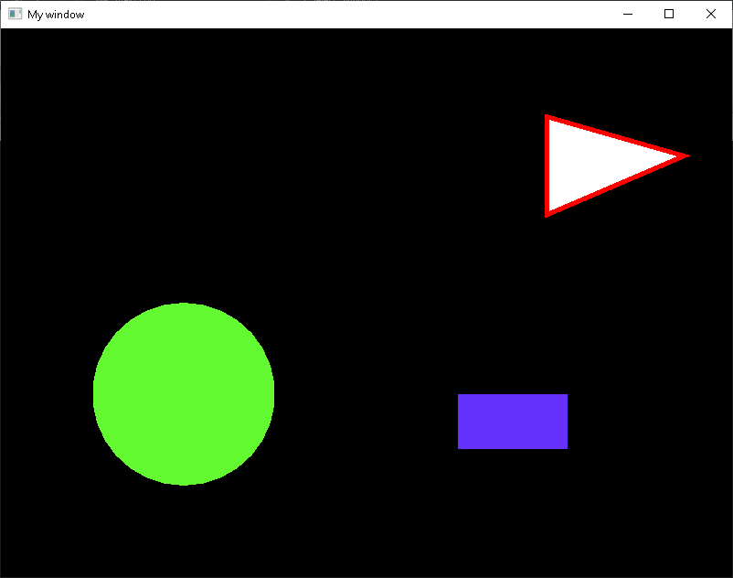

Wprowadzenie do SFML
=============

Używanie bibliotek zewnętrznych
-------------------------------------------
Do tej pory na zajęciach korzystaliśmy z bibliotek standardowych dostarczanych wraz z zestawem narzędzi deweloperskich (SDK) dla danego systemu. Wykorzystanie biblioteki wymagało jedynie załączenia odpowiedniego pliku nagłówkowego w kodzie programu. W związku z faktem, że były to biblioteki standardowe, ich lokalizacja była znana dla kompilatora.

Dodanie zewnętrznej biblioteki wymaga modyfikacji ustawień projektu poprzez wskazanie gdzie dana biblioteka jest umieszczona. Ponadto, załączana przez nas biblioteka SFML będzie dostarczona w postaci skompilowanej. Oznacza to, że plik nagłówkowy będzie zawierał jedynie deklaracje funkcji, a ich implementacja dostarczona jest w postaci plików zawierających skompilowany kod, które należy wskazać *linkerowi* w celu poprawnego zbudowania projektu.

### Tworzenie projektu wykorzystującego SFML

Wykorzystamy środowisko Qt Creator, skonfigurowane z kompilatorem MSVC z pakietu Visual C++ 2017 dla architektury 64-bit.

Pobierz aktualną wersję biblioteki SFML ze strony jej twórców (https://www.sfml-dev.org/download/sfml/2.5.1/). Wybierz wersję odpowiednią dla używanego systemu, kompilatora i architektury (*Visual C++ 15 (2017) - 64-bit*). Rozpakuj ją w wybrane miejsce na dysku, instrukcja zakłada lokalizację katalogu z biblioteką bezpośrednio na dysku `C:`.

Stwórz projekt aplikacji zgodnie z instrukcją [Instalacja Qt Creator](Instalacja%20Qt%20Creator.html). Umieść w projekcie plik `main.cpp` z zawartością pobraną z odnośnika [hello_sfml.cpp](../resources/hello_sfml.cpp).

Spróbuj skompilować projekt. **Kompilator** zwróci błąd o braku pliku nagłówkowego `SFML/Window.h` - nie ma go w ścieżkach systemowych, które przeszukuje. Dodaj brakującą ścieżkę do ustawień projektu modyfikując plik `.pro` opisujący projekt:

```
INCLUDEPATH += "C:/SFML-2.5.1/include"
```

Wymuś ponowne przetworzenie pliku `.pro` klikając prawym przyciskiem na nazwę projektu w drzewie i wybierając *Run qmake*.

Ponownie spróbuj skompilować projekt. Tym razem błędy typu *unresolved external symbol* zwróci **linker** - program "składający" ostateczny plik wykonywalny z wcześniej skompilowanych fragmentów. Oznacza to, że funkcje, których użyto w programie zostały znalezione w plikach nagłówkowych, ale nie udało się znaleźć ich skompilowanej implementacji - zawarta jest ona w plikach `*.lib` dostarczonych z biblioteką. Dodaj do pliku `*.pro` dodatkowe parametry linkera zawierające ścieżkę, pod którą można je znaleźć, a także listę plików, które mają zostać zlinkowane:

```
LIBS += -L"C:/SFML-2.5.1/lib"
LIBS += -lsfml-audio -lsfml-graphics -lsfml-network -lsfml-system -lsfml-window
```

Ponownie uruchom *qmake*, a następnie skompiluj projekt. Kompilacja powinna przebiec bez błędów, jednak nadal nie będzie możliwe uruchomienie programu.

Wynika to z faktu, że biblioteki, które dołączyliśmy do projektu nie są wkompilowane w plik wykonywalny - są łączone dynamicznie (ang. *DLL - Dynamic-Link Library*) i ładowane z zewnętrznych plików w trakcie uruchamiania. Mogą być dzięki temu współdzielone pomiędzy wiele programów, które dzięki temu mają mniejszy rozmiar. Pliki DLL można umieścić w katalogach systemowych lub w katalogu, gdzie znajduje się plik wykonywalny programu (sposób preferowany).

Skopiuj pliki `.dll` z katalogu `bin` biblioteki SFML do katalogu, w którym znajduje się plik wykonywalny  (`exe`) utworzonej przez Ciebie aplikacji. W przypadku środowiska Qt Creator, katalog kompilacji domyślnie znajduje się obok katalogu projektu i ma nazwę *build-<nazwa_projektu>-<nazwa_kitu>-<nazwa_wydania>*, np. *build-sfml_hello-Desktop_Qt_5_10_1_MSVC2017_64bit-Debug*. Następnie uruchom projekt. Poprawnie działający program powinien wyświetlić następujące okienko:



Biblioteka SFML
----------

SFML jest wieloplatformową biblioteką ułatwiających tworzenie programów wykorzystujących grafikę dwuwymiarową, np. prostych gier. Zawiera moduły pozwalające na m.in. generowanie grafiki - rysowanie prostych figur geometrycznych wraz z teksturami, obsługę wejścia klawiatury/myszy, dźwięku i sieci.

Dokumentację API biblioteki można znaleźć pod adresem:
https://www.sfml-dev.org/documentation/2.5.1/

Tutoriale opisujące podstawową funkcjonalność są dostępne:
https://www.sfml-dev.org/tutorials/2.5/

Wszystkie zasoby biblioteki znajdują się w przestrzeni nazw (ang. *namespace*) `sf`. Aby uniknąć zaśmiecania głównej przestrzeni nazw, będziemy unikać stosowania dyrektyw `using namespace ...`, a zamiast tego poprzedzać odpowiednie nazwy `sf::`, `std::` itd. 

W przykładzie powyżej przedstawiono typowy przebieg działania aplikacji wykorzystującej SFML. Obejmuje on inicjalizację okna (klasa `sf::RenderWindow`) i zasobów wykorzystywanych w programie (w tym przypadku trzy kształty), a następnie wykonywanie cyklicznie pętli programu, której każdy przebieg prowadzi do wygenerowania jednej klatki obrazu, aż do chwili zamknięcia głównego okna.

Wewnątrz pętli sprawdzana jest kolejka zdarzeń (naciśnięcia klawiszy, ruch myszy itd.), a następnie generowana jest od postaw klatka obrazu: czyszczone jest "płótno" okna, rysowane są kolejne obieky, a ostatecznie podmieniany jest *framebuffer*.

---
#### Zadanie do realizacji
Przeanalizuj działanie przykładowego kodu. Zmień rozmiar i ułożenie elementów na scenie. Co się dzieje, kiedy zmienisz rozmiar okna po uruchomieniu programu? W jakich jednostkach są wyrażone rozmiary i położenie obiektów na scenie?

---

## Pomiar czasu, animacje

Animacja obiektów polega na wyświetleniu nieznacznie zmienionego obiektu w każdej klatce obrazu (w każdym przebiegu głównej pętli) tak aby uzyskać wrażenie płynnego ruchu.

Aby animacja obiektów była płynna, a jej tempo niezależne od liczby wyświetlanych klatek na sekundę, musimy dostosować kolejne klatki animacji, na przykład na jeden z poniższych sposobów:

* mierzyć czas jaki upłynął od narysowania ostatniej klatki i na tej podstawie ustalić krok animacji;
* wywoływać poruszanie obiektami z oddzielnego wątku, ze stałą częstotliwością;
* założyć stałą liczbę klatek na sekundę - w tym przypadku, jeśli komputer nie nadąży z obliczeniami lub wyświetlaniem, animacja zwolni.

W dzisiejszym przykładzie wykorzystamy pierwszą metodę. Do pomiaru czasu możemy wykorzystać klasę `sf::Clock`. Jest to zegar działający na zasadzie stopera, który zaczyna odmierzanie czasu w momencie utworzenia obiektu. Pozwala on na odczytanie czasu jaki upłynął oraz restart odmierzania.

---
#### Zadanie do realizacji

Zapoznaj się z dokumentacją klasy `sf::Clock`. Dodaj do programu obiekt `sf::Clock` w taki sposób, aby móc zmierzyć czas pomiędzy kolejnymi przebiegami głównej pętli. Wyświetl czas w konsoli, w mikrosekundach. Ile klatek na sekundę rysuje Twój program?

---

## Poruszanie obiektem

Wszystkie obiekty "rysowalne" w bibliotece SFML mają zestaw metod pozwalających na ich manipulację na płaszczyźnie ekranu - przemieszczanie, skalowanie, obracanie. Metodą pozwalającą na poruszanie *względem bieżącej pozycji* jest `move(float offsetX, float offsetY)`.

---
#### Zadanie do realizacji

Utwórz w programie dwie zmienne reprezentujące prędkość jednego z obiektów - składową poziomą (x) i pionową (y), np. `rectangle_velocity_x` oraz `rectangle_velocity_y`. Będą one oznaczały prędkość obiektu w pikselach na sekundę. Nadaj im wartości odpowiednio 50 i 150.

Wykorzystaj czas obliczony w poprzednim zadaniu i w każdym przebiegu pętli przesuwaj obiekty metodą `move` o dystans, jaki powinny przebyć w zmierzonym czasie przy zadanej prędkości.

---

## Proste kolizje

Metoda `getGlobalBounds()`...


***
Autorzy: *Jakub Tomczyński*, *Michał Fularz*, *Piotr Kaczmarek*, *Michał Nowicki*, *Jan Wietrzykowski*
