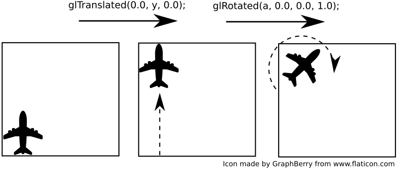
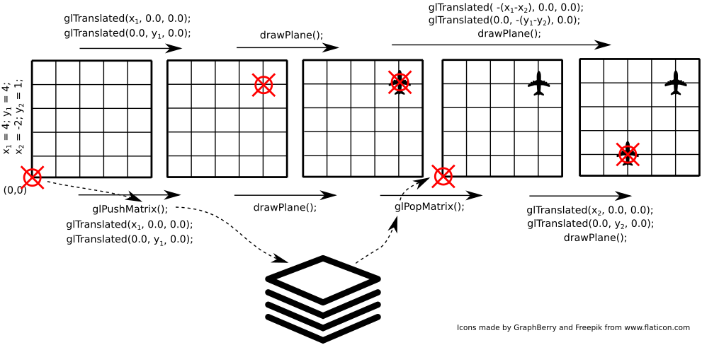

OpenGL
=============

OpenGL i GLU w SFML
-------------------------------------------
OpenGL jest otwartym niskopoziomowym API pozwalającym na generowanie trójwymiarowej grafiki. Ponieważ biblioteka SFML wykorzystuje wewnętrznie OpenGL do rysowania grafiki 2D, możemy ją wykorzystać jako bibliotekę pomocniczą ułatwiającą np. utworzenie okna i obsługę zdarzeń wejścia.

OpenGL dostarcza m.in. funkcje rysujące pojedyncze wielokąty lub serie wielokątów oraz ich przekształcenia. Nieco bardziej wysokopoziomowe funkcje są częścią biblioteki GLU (GL Utilility Library).

Ponieważ będziemy wykorzystywać bezpośrednio funkcje OpenGL oraz GLU, wymagane jest dołączenie ich do listy bibliotek dla przekazanych w parametrach linkerowi. W przypadku środowiska Qt Creator, dodajemy do pliku `.pro` poniższą linię:

```
LIBS += -lOpenGL32 -lglu32
```

### Pierwszy program OpenGL + SFML

Stwórz projekt do pracy z SFML oraz OpenGL. Umieść w projekcie plik `main.cpp` z zawartością pobraną z odnośnika [sfml_hello.cpp](../resources/sfml_opengl.cpp).

Uruchom program. Na ekranie powinien się pojawić obracający się kolorowy sześcian.

Struktura kodu programu jest analogiczna do poprzednich programów SFML - następuje inicjalizacja środowiska (w tym parametrów OpenGL, takich jak np. model oświetlenia), a następnie w głównej pętli rysowane są klatki obrazu.

W trójwymiarowej grafice komputerowej najczęściej wykorzystuje się reprezentację brył w postaci siatki wielokątów - każdy obiekt zbudowany jest z płaskich wielokątów (najczęściej trójkątów lub czworokątów), które mają wspólne wierzchołki i krawędzie. Pozwala to w łatwy sposób stworzyć proste bryły, a także przybliżyć skomplikowane obiekty dostatecznie gęstą siatką.

Załączona funkcja rysująca sześcian rysuje każdą z jego ścian jako kwadrat, w różnych kolorach.

Aby zapewnić stałe proporcje wyświetlanego obrazu i zakres widoczności w pionie, po każdym *evencie* typu `sf::Event::Resized` (zmiana rozmiaru okna), wywoływana jest funkcja `set_viewport`. Funkcja ta wykorzystując informacje o nowym rozmiarze okna ustawia odpowiednio zakres widzianej sceny (`glFrustrum`) oraz ustawia pozycję kamery (`gluLookAt`).

---
#### Zadanie do realizacji
Przeanalizuj działanie przykładowego kodu. Sprawdź działanie funkcji `glTranslated`, `glRotated` i `glColor3d` poprzez modyfikację ich parametrów. Spróbuj wywnioskować jak ułożone są osie układu współrzędnych sceny. 

---

### Transformacje geometryczne w OpenGL

Aplikacje OpenGL wykorzystują układ współrzędnych do lokalizacji obiektów na scenie. Aby uniknąć konieczności ręcznego przeliczania położeń wierzchołków obiektów na scenie, układ ten można transformować (m.in. przesuwać i obracać):
* `glTranslated(double x, double y, double z)` - przesuwa układ współrzędnych o odległości podane jako argumenty,
* `glRotated(double angle, double x, double y, double z)` - obraca układ współrzędnych o kąt `angle` (w stopniach) wokół osi zdefiniowanej przez parametry `x`, `y`, `z`.

Należy pamiętać, że kolejność ma istotne znaczenie. Rozważ poniższe przykłady:

* w pierwszej kolejności wykonano operację translacji (przesunięcia), a następnie rotacji (obrotu):



* w drugim przykładzie zrealizowano te same transformacje, jednak w odwrotnej kolejności - najpierw rotację (obrót), a następnie translację (przesunięcie).


W efekcie wykonanie tych samych operacji (ale w innej kolejności) daje inny efekt - porównaj położenie oraz orientację samolotu w obu przypadkach.

W celu ułatwienia powrotu do punktu wyjścia (np. po wykonaniu szeregu przekształceń) udostępniono następujące funkcje:
* `glPushMatrix()` - zapisuje aktualny stan (położenie oraz orientację) układu współrzędnych,
* `glPopMatrix()` - pobiera ostatnio zapisany stan (położenie oraz orientację) układu współrzędnych.
Należy pamiętać, że dla każdego wywołania `glPushMatrix()` obowiązkowo należy wywołać jedno `glPopMatrix()`. Można traktować je jak klamry opasające fragment kodu, którego tyczą się przekształcenia.

Rozważmy przykład przedstawiony na rysunku poniżej:



Planujemy narysować dwa samoloty - w punkcie *(4, 4)*, a następnie *(2, 1)*. Bez wykorzystania funkcji `glPushMatrix()` / `glPopMatrix()` (operacje przedstawione nad obrazkiem) niezbędne jest wyliczenie jak przesunąć się z punktu *(4, 4)* do *(2, 1)*. W zaprezentowanym przykładzie wydaje się to łatwe, ale przekształceń może być więcej i mogą być wśród nich rotacje komplikujące zadanie.
Z wykorzystaniem funkcji `glPushMatrix()` / `glPopMatrix()` (operacje pod rysunkiem) zadanie jest mniej skomplikowane - nie trzeba wykonywać żadnych transformacji odwrotnych - wystarczy na początku zapamiętać aktualny stan, a później do niego powrócić.

---
#### Zadanie do realizacji
Dodaj do sceny dwa dodatkowe sześciany o różnych wielkościach. Każdy z nich rysuj w innym miejscu sceny i obracaj wokół innej osi. Wykorzystaj funkcje `glPushMatrix()` / `glPopMatrix()`.

---

Poza przesuwaniem i obracaniem układu można go również skalować (funkcja `glScaled()`).

---
#### Zadanie do realizacji
Korzystając z pętli zdarzeń dodaj do programu możliwość przesuwania kamery w poziomie klawiszami *WSAD* oraz oddalania/przybliżania widoku kółkiem myszy (event `sf::Event::MouseWheelScrolled` oraz pole `event.mouseWheelScroll.delta`).

*Podpowiedź*: zamiast przesuwać kamerę możesz zmodyfikować (przesuwać i skalować) układ współrzędnych, w którym rysowane są wszystkie obiekty.

---


Zadanie
-----------
#### 1. Planetarium

Napisz program obrazujący ruch planet w Układzie Słonecznym.

Napisz klasę `CelestialBody` reprezentującą ciało niebieskie - aby lepiej widzieć ruch obrotowy planet, możesz reprezentować je jako sześciany.

Cechy ciała niebieskiego:

* średnica
* odległość od słońca
* okres ruchu obrotowego
* okres ruchu obiegowego
* kolor powierzchni

Klasa powinna mieć metodę `step(float time)` (analogicznie do programów z poprzednich zajęć) oraz `draw()` powodującą narysowanie planety.

Zastanów się nad kolejnością transformacji potrzebnych do narysowania planety w odpowiednim miejscu i o odpowiednim kącie obrotu (podpowiedź: nie potrzebujesz trygonometrii!).

Wczytaj zawartość pliku [solar_system.txt](../resources/solar_system.txt) i na jego podstawie utwórz obiekty na scenie reprezentujące wszystkie planety i słońce. **Uwaga:** odległości i średnice w pliku są zmodyfikowane tak, aby wizualizacja pozostała czytelna. Prawdziwe wartości można znaleźć w pliku [solar_system_real.txt](../resources/solar_system_real.txt)


***
Autorzy: *Jakub Tomczyński*, *Tomasz Mańkowski*
