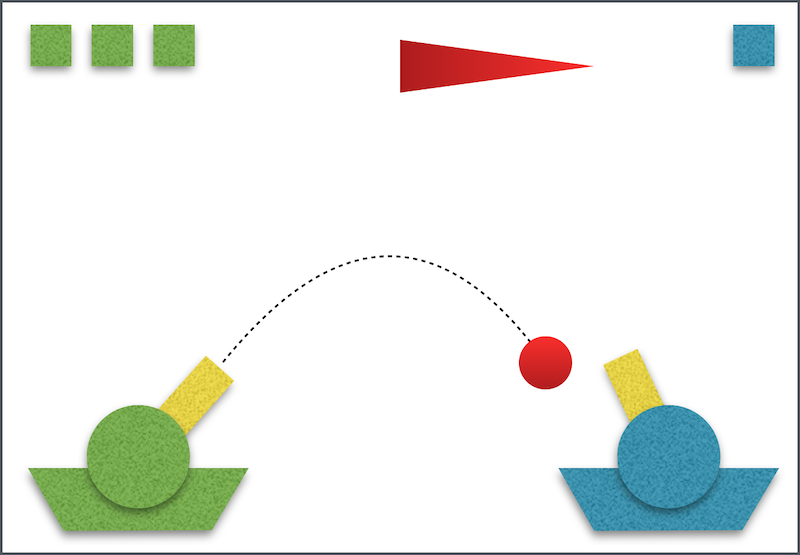

# Klasy, SFML - powtórka

## Zadanie - gra "Czołgi"

Napisz grę w czołgi dla dwóch graczy korzystając z biblioteki SFML:

1. Stwórz klasę `Tank` reprezentującą czołg złożony z trapezoidalnego podwozia, okrągłego kadłuba i lufy.

Klasa powinna mieć interfejs pozwalający na (minimum):
* obracanie lufy
* przesuwanie czołgiem lewo-prawo

2. Dodaj do sceny dwa czołgi u dołu ekranu.

3. Stwórz klasę `Projectile` reprezentującą pociski. Pocisk powinien mieć możliwość zadania prędkości, powinna na niego działać również grawitacja (przyspieszenie w dół).

4. Dodaj obsługę klawiatury

Czołg 1:
* `A`/`D` - poruszanie lewo/prawo
* `W`/`S` - obracanie lufy lewo/prawo

Czołg 2:
* `←`/`→` - poruszanie lewo/prawo
* `↓`/`↑` - obracanie lufy lewo/prawo

5. Dodaj możliwość strzelania i animację pocisków.

Pociski powinny zostać "wystrzeliwane" z odpowiedniego czołgu po naciśnięciu przycisku (czołg 1 - `E`, czołg 2 - `spacja`). Na ekranie może znajdować się jednocześnie dowolna liczba pocisków.

*Podpowiedź*: składowe x/y prędkości początkowej pocisku to *cos*/*sin* kąta nachylenia lufy.

6. Dodaj do klasy `Tank` liczbę "żyć" i metodę pozwalającą na sprawdzenie kolizji z obiektem `Projectile`. Z jej wykorzystaniem dodaj mechanikę gry:

* każde trafienie pociskiem przeciwnika powoduje zmniejszenie liczby żyć
* spadek żyć do 0 powoduje zakończenie gry i wyświetlenie odpowiedniego komunikatu w konsoli

**Bonusy**:

1. Dodaj do gry losowo zmieniający się co określony czas wiatr (wiejący lewo-prawo)
* aktualna prędkość wiatru wyświetlana jest u góry ekranu w postaci trójkątnej chorągiewki
* wiatr wpływa na ruch pocisków jako ich przyspieszenie poziome

2. Dodaj wskaźnik żyć każdego z graczy w rogu ekranu.

Przykładowa makieta przedstawiająca interfejs gry:

***
Autor: *Jakub Tomczyński*
