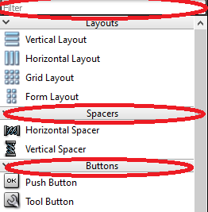
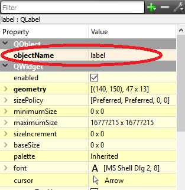
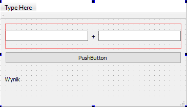
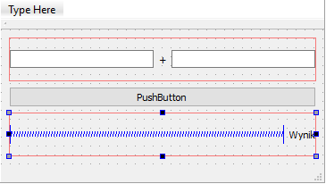

# Qt - wstęp do GUI

## Graficzny interfejs użytkownika (GUI)

Graficzny interfejs użytkownika (ang. Graphical User Interface, GUI) jest jednym ze sposobów przekazywania użytkownikowi komputera informacji i równocześnie sposobem na pobieranie od niego informacji zwrotnej. Każdy system system operacyjny oferuje swój własny menadżer interfejsu graficznego. Aktualnie najpopularniejsze to:

* Windows: 
    * Luna (XP),
    * Aero (Vista, 7, 8, 8.1, 10),
    * Modern UI (8, 8.1, 10).
* Linux: 
    * Unity (Ubuntu),
    * KDE,
    * GNOME.
* macOS:
    * Aqua.
    
Większość współczesnych GUI opiera się o tzw. widżety (ang. *widget*), inaczej nazywane kontrolkami. Widżet jest pojedynczym elementem GUI, może nim być: okno, przycisk, suwak, pole do wpisywania tekstu itd. Widżet nie koniecznie musi być elementem widocznym, może być na przykład kontenerem rozmieszczającym pozostałe widżety wewnątrz okna. Współcześnie większość dostępnych widżetów ma strukturę obiektową. Każdy widżet na wejście otrzymuje zdarzenia generowanie przez użytkownika (kliknięcie myszką, przycisk klawiatury), a także zdarzenia generowanie przez system (w tym menadżera interfejsu graficznego). W odpowiedzi widżet rysuje swoją reprezentację graficzną w wyznaczonej mu przestrzeni ekranu i/lub przekazuje informacje od użytkownika do programu i odwrotnie.

## Biblioteka interfejsu graficznego

Aby możliwe było korzystanie z interfejsu graficznego konieczne jest wykorzystanie biblioteki interfejsu graficznego zwanej także biblioteką widżetów. Każdy program działający pod kontrolą danego systemu operacyjnego (i menadżera GUI) może korzystać z innego zestawu widżetów/kontrolek.

* Dla systemów Windows, firma Microsoft dostarcza dedykowane biblioteki kontrolek pod postacią WinForm i WPF, które są składową .NET Framework. 
* Dla systemów macOS aktualnie obowiązującą, natywnie obsługiwaną biblioteką jest Cocoa. 
* Rozwiązania wywodzące się z systemów typu Linux, dzięki założeniu open-source, aktualnie zdobywają dużą popularność, głównie ze względu na swoją wieloplatformowość. Wiele z nich posiada wersje zarówno na systemy Linux, jak i Windows i OS X, dzięki czemu raz przygotowana aplikacja może zostać uruchomiona na wszystkich tych platformach. Są to m.in. GTK+ (opracowane na potrzeby programu GIMP) i Qt (natywna biblioteka dla środowiska KDE).

## Qt framework

Qt (wym. od ang. słowa cute - uroczy), poza biblioteką widżetów, od wersji Qt4.0 dostarcza także wieloplatformowy framework programistyczny dla języka C++. Qt ujednolica obsługę wielu elementów pomiędzy różnymi platformami, które dotychczas wymagały oddzielnego traktowania w różnych systemach. Jest to m.in. obsługa sieci, multimediów, XML i wielu, wielu innych. Dzięki wykorzystaniu Qt wysiłek włożony w przeniesienie programu napisanego np. pod Windowsem na Linuxa jest minimalny. Qt kompatybilne jest także z Mac OS X i Androidem.

Qt jest mocno obiektowo zorientowaną biblioteką wykorzystującą język C++. W czasie wykorzystywania Qt możliwe jest korzystanie z wszystkich funkcjonalności języka C++ a także z biblioteki STL. Jednakże biblioteka Qt implementuje własne struktury danych i obiekty, często o dodatkowej, specyficznej dla biblioteki Qt, funkcjonalności niż te dostępne w STL. W celu zachowania 100% kompatybilności i przejrzystości kodu sugeruje się wykorzystywanie tych dostarczanych przez Qt.

Poniżej przedstawiono prosty konsolowy program napisany z wykorzystaniem STL:

```cpp
#include <iostream>
#include <vector>
#include <string>

int main(int argc, char *argv[]) {
    std::cout << "Hello World!" << std::endl;

    std::vector<std::string> sentence;

    for(int i = 0; i < 4; i++) {
        std::string word;
        std::cin >> word;
        sentence.push_back(word);
    }
    return 0;
}
```

oraz Qt:

```cpp
#include <QCoreApplication>
#include <QTextStream>
#include <QVector>
#include <QString>

int main(int argc, char *argv[]) {
    QCoreApplication a(argc, argv);

    QTextStream qout(stdout);
    QTextStream qin(stdin);

    qout << "Hello World!" << endl;

    QVector<QString> sentence;

    for(int i =0; i < 4; i++) {
        QString word;
        qin >> word;
        sentence.push_back(word);
    }
    return a.exec();
}
```

## Tworzenie projektu aplikacji okienkowej w Qt

Otwórz Qt Creator, następnie wybierz menu *File*  → *New File or Project…*. W liście *Projects* wybierz kategorię *Application*, następnie *Qt Widgets Application*. Zatwierdź wybór przyciskiem *Choose…*.

Nadaj nazwę swojemu projektowi i wybierz lokalizację, naciśnij *Next*.

Kolejne okno pozwala na zdefiniowanie nazwy klasy, która będzie bazą naszej aplikacji okienkowej. Zwyczajowo taką klasą bazową jest widżet *MainWindow* (pamiętasz, że okno też jest widżetem?) będący głównym oknem aplikacji. Nazwę głównego okna można oczywiście zmienić. Ważne aby nasza klasa dziedziczyła po *QMainWindow* (patrz: *Base class*). Upewnij się że zaznaczono *Generate form*, dzięki temu automatycznie stworzony plik opisujący wygląd głównego okna. Naciśnij *Next*, a następnie *Finish*.

### Szkielet programu okienkowego w Qt

Utworzenie projektu z szablonu aplikacji okienkowej spowoduje dodanie do projektu dodatkowych plików opisujących główne okno: `mainwindow.h` i `mainwindow.cpp` opisujące klasę okna od strony kodu oraz plik `mainwindow.ui` zawierający opis układu (wyglądu) okna.

Punktem wejściowym dla programu jest plik `main.cpp`, zawierający funkcję `main`:

```cpp
#include "mainwindow.h"
#include <QApplication>

int main(int argc, char *argv[]) {
    QApplication a(argc, argv); // creates "application" object
    MainWindow w; // creates main window object
    w.show(); // shows main window

    return a.exec(); // starts application event loop
}
```

Widać, że powyższa struktura jest bliźniaczo podobna do konsolowego przykładu ze wstępu. `QApplication a(argc, argv)` tworzy obiekt będący pętlą główną Qt obsługującą zdarzenia. Następnie tworzona jest instancja obiektu `MainWindow`. Ostatecznie `a.exec()`; uruchamia pętlę zdarzeń Qt.

W bibliotece Qt wszystkie obiekty ostatecznie dziedziczą po klasie `QObject`, nie inaczej jest w przypadku klasy głównego okna stworzonej automatycznie przez Qt Creator. W tym przypadku kolejność dziedziczenia jest następująca `QObject` → `QWidget` → `QMainWindow` → `MainWindow`. Deklaracja klasy głównego okna prezentuje się następująco:

```cpp
#include <QMainWindow>

namespace Ui {
    class MainWindow;
}

class MainWindow : public QMainWindow {
    Q_OBJECT // macro required for Qt meta-object functionality
public:
    explicit MainWindow(QWidget *parent = 0);
    ~MainWindow();
private:
    Ui::MainWindow *ui; // pointer to GUI elements of the window
};
```

Konieczna jest oczywiście definicja poszczególnych elementów klasy okna głównego. Qt Creator wykonał to za nas automatycznie i prezentuje się ona następująco:

```cpp
#include "mainwindow.h"
#include "ui_mainwindow.h"

MainWindow::MainWindow(QWidget *parent) :
    QMainWindow(parent), // calls base class constructor
    ui(new Ui::MainWindow) { // allocates memory for GUI object and calls its constructor
    
    ui->setupUi(this); // initialises GUI
}

MainWindow::~MainWindow() {
    delete ui; // deletes GUI object
}
```

Na tym etapie konstruktor jedynie konfiguruje GUI, natomiast destruktor, wywoływany przy zamknięciu aplikacji, usuwa informacje o GUI z pamięci.

Uruchom program utworzony z szablonu.

### Obsługa Qt Designer

Klikając dwukrotnie na dowolny plik z rozszerzeniem `.ui` (w naszym przypadku `mainwindow.ui`) edytor programu zamienia się na Qt Designer. Jest to tryb w którym za pomocą metody przeciągnij-i-upuść możemy przygotować wygląd GUI.

Po lewej stronie dostępny jest pionowy pasek zawierający listę standardowych widżetów Qt. Widżety pogrupowane są w zależności od podstawowych funkcjonalności. Na górze znajduje się także pasek Filter pozwalający na przeszukiwanie listy:



* Zapoznaj się z listą widżetów. Czy wszystkie ich nazwy, opatrzone rysunkami, są wystarczająco klarowne i objaśniają ich działanie? W razie potrzeby wesprzyj się wyszukiwarką Google.

* Za pomocą metody przeciągnij-i-upuść umieść na projekcie okna jeden QPushButton, jeden QLabel i dwa QLineEdit. Spróbuj zmienić ich położenie oraz rozmiar.

* Uruchom program i zaobserwuj zachowanie widżetów umieszczonych na oknie.

Po prawej stronie Qt Designera znajduje się *Property Editor*, jest to zbiór pól pozwalających na edycję własności poszczególnych widżetów. Wyświetlane są informacje o widżecie, na którym zatrzymany jest aktualnie focus (ostatnio zaznaczony widżet). Należy pamiętać, że samo okno także jest widżetem i posiada swoje własności, które można edytować w Property Editorzer. Każdy rodzaj widżetu będzie posiadał własne, unikalny dla swojego typu zestaw własności. 

Każdy widżet musi posiadać unikalną w obrębie danego okna nazwę. Nazwę nadajemy przez edycję własności *objectName*:



* Zmień *objectName* dla poszczególnych widżetów umieszczonych na oknie (np: `QPushButton`: *addButton*; `QLineEdit`: *inputValue1*, *inputValue2*; `QLabel`: *result*).

Widżety posiadają także szereg innych funkcjonalności, dotyczących głównie ich wyglądu:

* Zmień treść wyświetlaną na `QPushButton`.
* Zmień tytuł wyświetlany na pasku okna `MainWindow`.
* Zmień czcionkę wyświetlaną przez `QLabel`.
* Zapoznaj się z własnością enable.
* Przejrzyj pozostałe własności poszczególnych widżetów.

### Layout

Widżety umieszczone na oknie nie są w żaden sposób powiązane z rozmiarem okna. Zawsze, niezależnie od rozmiaru okna, będą zakotwiczone się w jednej, odgórnie zdefiniowanej, pozycji i będą posiadać stały rozmiar:

* Uruchom program i spróbuj zmienić rozmiar okna. Czy umieszczone w nim widżety są zawsze widoczne?

Qt posiada system automatycznego dopasowywania położenia widżetów i ich rozmiaru, zależnie od aktualnego wyglądu okna, w którym się znajdują, nazywany *Layout*. *Layout* jest widżetem wewnątrz którego można umieścić inne elementy GUI.

Podstawową metodą rozmieszczenia elementów na oknie za pomocą *Layout* jest mechanizm wbudowany w każde okno:

* Kliknij prawym klawiszem na oknie i z menu kontekstowego wybierz *Lay Out*, a następnie *Lay Out in a Grid*. Elementy Powinny zostać automatycznie rozmieszczone na oknie. Uruchom program i sprawdź zachowanie widżetów w czasie zmiany rozmiaru okna.

* Istnieje możliwość reorganizacji elementów okna metodą drag-and-drop, spróbuj zmienić umieszczenie widżetów layoucie. Uruchom program dla różnych konfiguracji i sprawdź zachowanie.

Możliwe jest zagnieżdżanie jednego layoutu wewnątrz drugiego:

* Z biblioteki widżetów wybierz *Horizontal Layout* i umieść go na oknie.

* Spróbuj rozmieścić elementy na oknie tak aby uzyskać następujący efekt:



* Przetestuj działanie programu.

Czasami istnieje konieczność zadania minimalnego i maksymalnego wymiaru każdego z widżetów. Dlatego dla każdego widżetu można znaleźć własności *minimumSize* i *maximumSize*.

Istotnym widżetem, budującym layout okna, są także *Spacers*, czyli wypełniacze. Nie pełnią one żadnej roli poza nadawaniem wyglądu okna.

* Przetestuj zachowanie programu w momencie zmiany *minimumSize* i *maximumSize* poszczególnych widżetów.

* Spróbuj wykorzystać *Horizontal Spacer* i *Vertical Spacer* (one także mają minimalny i maksymalny wymiar).

* Wykorzystaj *Horizontal Layout* i *Horizontal Spacer* do przesunięcia wyniku (`QLabel`) do prawej krawędzi okna:



## Sygnały i Sloty

Qt implementuje mechanizm sygnałów i slotów, jest to narzędzie pozwalające na zarządzanie asynchronicznymi zdarzeniami pochodzącymi zarówno z programu, jak i od użytkownika lub systemu operacyjnego. Wykorzystanie sygnałów (ang. *signals*) i slotów (ang. *slots*) jest bardzo proste. Każdy klasa dziedzicząca po *QObject* w Qt może implementować sygnały, czyli funkcje emitujące jakieś zdarzenie, równocześnie każda klasa może implementować sloty, czyli funkcje przechwytujące i przetwarzające powyższe sygnały. Na przykład klasa `QPushButton` posiada sygnał `clicked()`, który jest emitowany w momencie naciśnięcia przez użytkownika przycisku. 

Istnieje możliwość automatycznego tworzenia połączeń pomiędzy elementami GUI a klasą okna głównego z poziomu Qt Designera. Qt Creator automatycznie tworzy slot i połączenie pomiędzy sygnałem widżetu, a tym slotem:

* Prawym klawiszem wybierz widżet *addButton* (`QPushButton`) i z menu kontekstowego wybierz *Go to Slot…*, następnie wybierz sygnał `clicked()` i zatwierdź przyciskiem OK.

Qt Creator przenosi użytkownika do trybu edycji programu, w miejsce klasy `MainWindow`, w którym stworzono metodę, wywoływaną w momencie wciśnięcia przycisku:

```cpp
void MainWindow::on_addButton_clicked() {
}
```

Równocześnie Qt Creator automatycznie tworzy deklarację slotu w klasie `MainWindow` (w pliku `mainwindow.h`):

```cpp
class MainWindow : public QMainWindow {
    /* ... */
private slots:
    void on_pushButton_clicked();
    /* ... */
};
```

* Ustaw breakpoint wewnątrz metody obsługi slotu (`void MainWindow::on_AddButton_clicked()`), uruchom program w trybie Debug, zweryfikuj poprawność działania slotu.

## Dostęp do elementów GUI

Wszystkie elementy GUI stają się polami w obiekcie `ui`, dlatego dostęp do nich jest zawsze następujący: `ui->objectName`, gdzie `objectName` jest nazwą widżetu nadaną w Property Editorze.

Jak w każdej obiektowo zorientowanej bibliotece wszystkie obiekty GUI posiadają metody pozwalające na modyfikację ich zachowania i wyglądu. Np. w celu zmiany tekstu wyświetlanego przez `QLabel` należy wykonać:

```cpp
ui->objectName->setText("Hello! This is my first Qt application");
```

* Umieść powyższą linię w metodzie obsługującej kliknięcie przyciskiem.

* Uruchom program i sprawdź jego poprawność zachowania. Treść `QLabel` powinna ulec zmianie po kliknięciu przyciskiem.

Odczytanie wartości z QLineEdit odbywa się w następujący sposób:

```cpp
QString text = ui->objectName->text();
```

* Zmodyfikuj program tak, aby każde naciśnięcie przycisku powodowało przepisane zawartości jednego z `QLineEdit` do `QLabel`.

Następnie:

* Zmodyfikuj program tak aby po naciśnięciu przycisku wartość wpisana w polach `QLineEdit` była dodawana i wyświetlana w `QLabel`.

Do zamiany `QString` na liczbę całkowitą wykorzystaj metodę `QString::toInt( )`:

```cpp
QString text = ui->objectName->text();
int value = text.toInt();
```

Do konwersji z liczby na `QString` wykorzystaj statyczną metodę `QString::number(value)`:

```cpp
int value = 15;
QString text = QString::number(value);
```

Informacje o tym jakie metody oferuje dany widżet czy obiekt danej klasy najłatwiej uzyskać na stronie z dokumentacją Qt, np: http://doc.qt.io/qt-5/qlabel.html 

## Zadania do samodzielnego wykonania

### 1. Kalkulator

Zadaniem jest stworzenie prostego graficznego kalkulatora. Kalkulator powinien posiadać

* 2 aktywne pola QLineEdit, do których użytkownik będzie mógł wpisać wartości, dla których będzie wykonywane działanie. 
* Nieaktywne (enabled = false) pole QLineEdit, do którego będzie trafiać wynik
* Przycisk "Oblicz"
* Cztery `QRadioButton`, reprezentujące które działanie jest wykorzystywane (dodawanie, odejmowanie, mnożenie, dzielenie). `QRadioButton` można grupować za pomocą `QGroupBox`.
* Przycisk CE kasujący zarówno zawartość pola wejściowego jak i wyjściowego.
* Dwa `QLabel` na których zostanie wyświetlony wynik w notacji binarnej i heksadecymalnej.

<!--Jeden przycisk QPushButton przepisujący wartość z pola wyniku do pierwszego pola wejściowego. Na przycisku zamiast opisu umieść grafikę strzałki symbolizującą opisaną operację. Wykorzystaj QPushButton::SetIcon( );  (poszukaj w Internecie jak wykonać).-->

### 2. Zaawansowany kalkulator

Stwórz kalkulator podobny do tego dostępnego w systemie Windows. Okno powinno posiadać pole, do którego można wpisać ręcznie wartość za pomocą klawiatury, lub za pomocą przycisków od 0 do 9 umieszczonych poniżej. Do formatowania wartości wejściowej QLineEdit wykorzystaj jego własność inputMask.  Każde wciśnięcie przycisku numerycznego dopisuje odpowiednią wartość na końcu okna wpisywania. Spróbuj wykorzystać QButtonGroup.  Stwórz drugą grupę przycisków odpowiedzialnych za wybór rodzaju działania i za wyświetlenie wyniku.

### 3. Edytor bazy danych

Stwórz program będący interfejsem bazy danych studentów. Użytkownik powinien mieć możliwość dodania nowego wpisu z użyciem pól: Imię, Nazwisko, E-mail, Nr Indeksu,  Mężczyzna/Kobieta (QRadioButton), Kierunku studiów (lista rozwijana - QComboBox), Czy ukończył studia (QCheckBox), Notatka (QPlainTextEdit). Stwórz klasę studenta zawierającą powyższe informacje, dodawaj nowe wpisy do QVector. Lista dostępnych wpisów powinna być wyświetlana na liście QListView. Dodaj możliwość podglądu wybranego wpisu oraz usuwania wybranego wpisu.


***
Autorzy: *Tomasz Mańkowski*, *Jakub Tomczyński*
